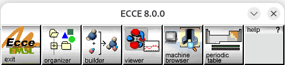
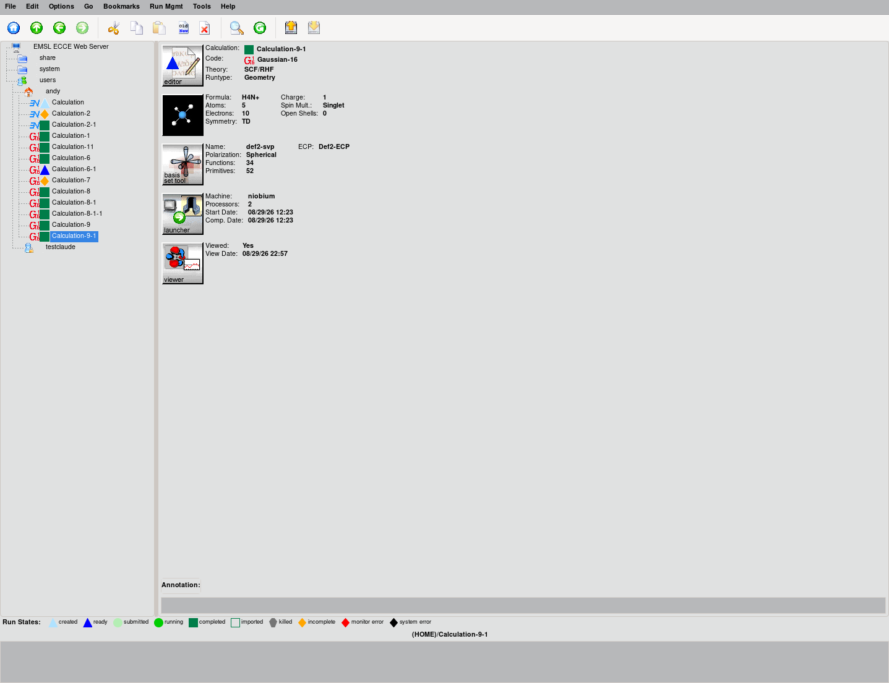
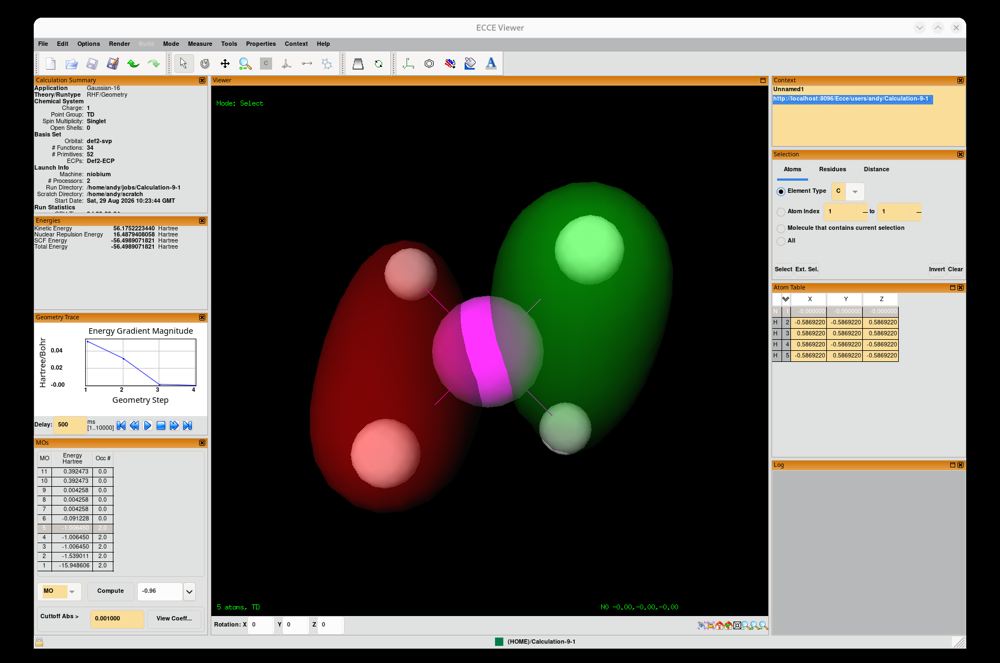

# ECCE

The Extensible Computational Chemistry Environment (ECCE, pronounced
"etch-ā") is a graphical user interface, scientific visualization toolkit,
and data management framework for setting up, running, and analyzing
computational chemistry calculations.

PNNL/EMSL stopped supporting ECCE, so we forked the source and maintain it
here.

**v8.0.0-alpha.1 — "Phoenix" — 2026-08-29**

After a lot of work, we've finally revived ECCE — it now compiles and
runs on modern Linux systems again (tested on Debian 13). This is a major
milestone, and the reason we're at version 8.0.0: we've made a lot of
changes under the hood to make future maintenance easier, on top of
bringing the application itself back to life.


## Screenshots

| Gateway | Organizer |
|---|---|
|  |  |



## What's new in this release

ECCE hadn't run on a current Linux system in years — the underlying tools
it was built on were over a decade out of date. This release doesn't add
new end-user features; it's a from-scratch modernization that keeps the
same application running on current software, replacing years-old
bundled dependencies with current, distro-maintained ones:

* **One-command install.** A single package installs everything, instead
  of the old multi-step manual setup.
* **Build system**: CMake/CPack replaces the old `build_ecce`/
  recursive-make workflow.
* **GUI toolkit**: wxWidgets 2.8.12 → 3.2.8, running on GTK3 instead of
  GTK2.
* **XML library**: Xerces-C 2.8.0 → 3.2.4.
* **OpenGL/Mesa**: a 2006-era bundled Mesa 6.5.3 → the system's current
  Mesa (25.0.7).
* **Language runtime**: Python 2 → Python 3 (3.13) for the helper GUI
  scripts.
* **Messaging**: the JMS broker moved from a bundled ActiveMQ 5.1.0
  (2008) to Debian's packaged ActiveMQ 5.17.6.
* **Data server**: moved from a vendored Apache httpd 2.2.25 build to
  Debian's packaged Apache 2.4.68.
* **Target platform**: Debian 13 ("trixie"), instead of a decade-old
  reference distro.

Porting a ~1200-file codebase across two major GUI-toolkit versions and a
completely different build system inevitably introduced its own new bugs
along the way — those were found and fixed too, but as stabilization work
to reach parity with the previous release, not as new value on top of it.

The full, detailed history of what was fixed and why lives in `CLAUDE.md`
and `ECCE_modernization_status.md`, if you want the technical story behind
any particular change.

## Installation and getting started

This covers a clean install on Debian 13 ("trixie") through to your first
login. (Other distributions may work but aren't currently tested.)

### 1. Install build dependencies

```
sudo apt-get install -y \
  build-essential gfortran cmake ninja-build \
  libwxgtk3.2-dev libxerces-c-dev libgl-dev libglu1-mesa-dev \
  libgtk-3-dev libx11-dev libice-dev \
  default-jdk ant git
```

Versions confirmed working, from a real Debian 13 ("trixie") install:
CMake 3.31, wxWidgets 3.2.8, Xerces-C 3.2.4, GTK3 3.24, OpenJDK 21, Ant
1.10. `cmake_minimum_required` in `CMakeLists.txt` sets a hard floor of
CMake 3.16 and wxWidgets 3.2 (older wx won't work — this is a wx3.2-only
port); nothing else pins a specific minimum, but older versions of the
rest haven't been tested.

### 2. Check out and build

```
git clone https://github.com/FriendsofECCE/ECCE.git
cd ECCE
mkdir -p build-cmake && cd build-cmake
cmake -G Ninja ..
ninja
```

The `-G Ninja` matters: without it, `cmake` falls back to its default
generator (Unix Makefiles on Debian), which produces a working build too,
but via `make` instead of the `ninja` command used everywhere else in this
document and in `CLAUDE.md`.

### 3. Package

```
cpack -G DEB
```

This produces `ecce_<version>_amd64.deb` in `build-cmake/`.

### 4. Install

Either install the package you just built, or skip steps 1-3 entirely and
download a prebuilt `.deb` from the
[Releases page](https://github.com/FriendsofECCE/ECCE/releases) — a
prebuilt package still needs the *runtime* dependencies below, just not
the build-time ones from step 1:

```
sudo apt-get install -y apache2 apache2-utils   # data server dependency
sudo dpkg -i ecce_<version>_amd64.deb
sudo apt-get install -f                         # pulls in any remaining dependencies
```

This installs to `/opt/ecce` and puts the apps on your `PATH` as
`ecce-<app>` — e.g. `ecce-gateway`, `ecce-organizer`, `ecce-builder`,
`ecce-pertable` — runnable by name, no environment setup required.

### 5. Create your account

ECCE needs a client and a server side even when both run on the same
machine. The background services start automatically the first time you
launch an app, but you need to create a login once, up front:

```
ecce-dataserver-start          # if not already running
ecce-dataserver-adduser        # interactive: prompts for name, username, password
```

Use a username matching your Linux username — that's what the login
dialog defaults to.

### 6. Start ECCE

```
ecce-gateway
```

This opens ECCE's main toolbar. Log in with the username/password you just
created. From there you can open the other tools — Organizer, Builder,
Periodic Table, and so on.

### Troubleshooting

See [`GETTING_STARTED.md`](GETTING_STARTED.md) for more detail on each of
these steps, known rough edges, and troubleshooting tips if something
doesn't come up cleanly.

## Registering a compute machine

Start `ecce-gateway`, then open Machine Browser. Go to Machine → Register
Machines… and register your new machine.

The simplest case is running everything locally: set Machine to your
machine's real hostname (run `hostname` to find it), and Name to whatever
identifying name you want. Vendor, model, and processor don't matter. Set
the total number of processors to an appropriate value, and nodes to 1.

SSH has been tested and works for communication with the machine.

**Using `localhost` instead of the real hostname**: this also works, but
needs one extra one-time step first. `localhost` resolves to both an
IPv4 and an IPv6 address on most systems, and SSH treats each address as
a separate host identity with its own trusted key — if you've only ever
connected to your machine by its real hostname (or never connected to
`localhost` at all), the very first `localhost` connection SSH tries
might hit an address whose key isn't trusted yet, which fails silently
(no prompt) when ECCE tries it non-interactively. Fix it once, up front,
by running `ssh localhost` in a terminal and accepting the host key
prompt — after that, registering `localhost` in ECCE works fine.

Each computational code needs the full path to its executable. Examples
from testing:

* **Gaussian 16**, installed under `/opt/gaussian/g16`: use
  `/opt/gaussian/g16/g16`.
* **NWChem**, installed from the Debian 13 repos: use `/usr/bin/nwchem`.
* **Perl 5**: use `/usr/bin/perl`.

Find the right path for anything else with `which`, e.g. `which perl`.

## Branches and releases

`main` is the only active branch — build and file PRs against it. Older
branches (`develop`, `stable`, `master`, `make`) have been consolidated
into `main` and preserved as `archive/*` for history; there's no reason to
branch from or compare against them going forward. Releases are marked
with tags, not separate release branches.

## General features

* Building molecular models.
* A graphical user interface to a broad range of electronic structure
  theory types. Supported codes include NWChem, GAMESS-UK, Gaussian 03,
  Gaussian 09, Gaussian 16, and Amica; other codes can be registered based
  on user requirements.
* A graphical user interface for basis set selection.
* Remote submission of calculations to Unix/Linux workstations, Linux
  clusters, and supercomputers, via PBS, LSF, Slurm, Moab, SGE,
  LoadLeveler, and Maui Scheduler queue management.
* Three-dimensional visualization and graphical display of molecular data
  and properties, both while jobs are running and after completion.
  Molecular orbitals and vibrational frequencies are among the properties
  displayed.
* Importing results from NWChem and Gaussian calculations run outside of
  the ECCE environment.

## Contributing

Issues and pull requests are welcome — see the
[issue tracker](https://github.com/FriendsofECCE/ECCE/issues). If you hit
a crash or a build failure, a lot of prior investigation may already be
recorded in `CLAUDE.md`; worth a search before filing something new.

## License

See [`LICENSE`](LICENSE).
