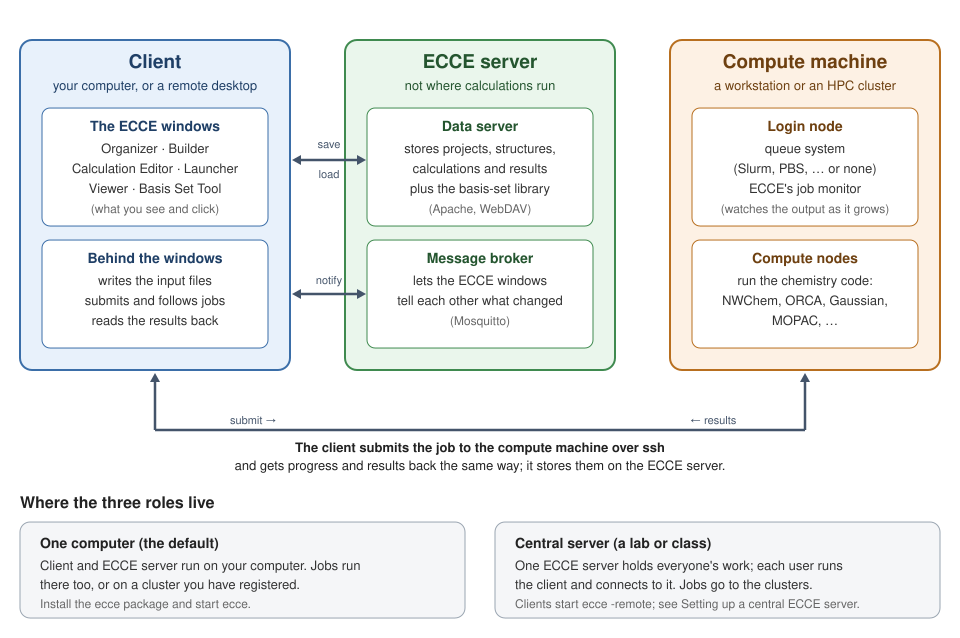
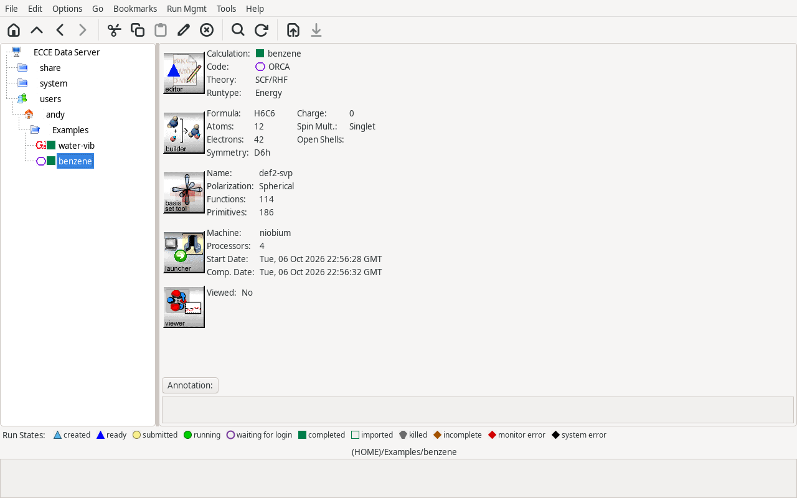
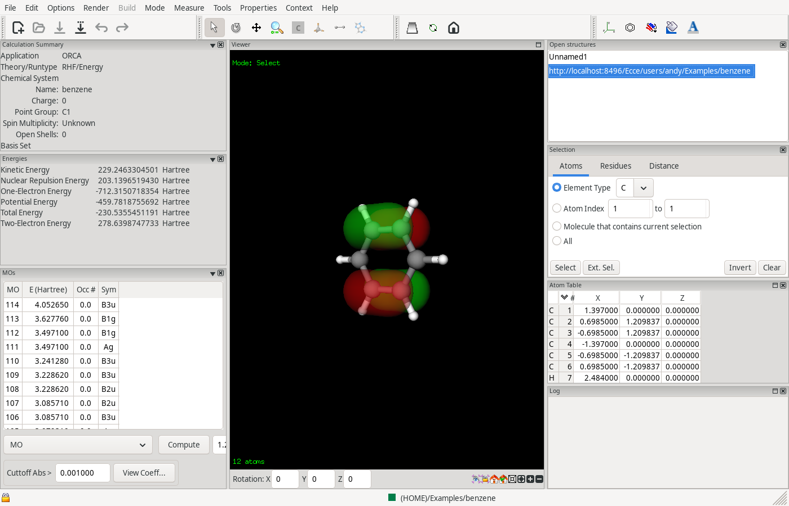
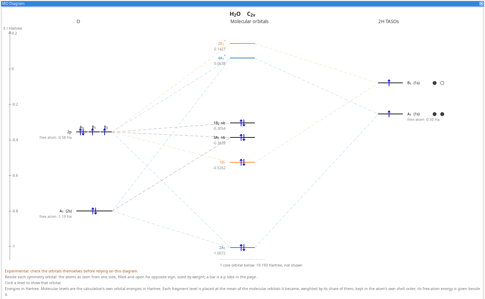

# ECCE

The Extensible Computational Chemistry Environment (ECCE, pronounced
"etch-ā") is a graphical user interface, scientific visualization toolkit,
and data management framework for setting up, running, and analyzing
computational chemistry calculations.

PNNL/EMSL stopped supporting ECCE around 2017, so we forked the source
(with their blessing) and maintain it here.

ECCE compiles and runs on modern Linux systems again. Debian 13 is the
platform it is tested on; CI also builds it on Ubuntu, Fedora and Rocky
Linux. Getting here took a modernization of the build system and every
major dependency, not just a recompile. `main` is the 9.0 development
line (9.0.0-alpha previews); the installation and first steps below
describe 9.0.

> **For production use: 8.18.x** (branch `stable-8`, latest
> [v8.18.6](https://github.com/FriendsofECCE/ECCE/releases/tag/v8.18.6)).
> Installation differs in one respect: 8.x is a single `ecce` package
> (`sudo apt install ./ecce_<version>_amd64.deb`) instead of `ecce-client`
> plus `ecce-server`. 8.x and 9.x clients and servers do not interoperate.
> Packages and notes are on the
> [releases page](https://github.com/FriendsofECCE/ECCE/releases).

## How ECCE is organised



The **ECCE server** stores your projects and results; it is not where
calculations run. Calculations run on a **compute machine**, a workstation
or an HPC cluster: the client submits each job there over ssh and stores
the results on the ECCE server. On a single computer all of
this is installed and started for you.

## General features

* **Build molecular models**, or import a structure and work from that.
* **Set up calculations through one interface** for **NWChem, Gaussian
  16, ORCA and MOPAC** — built, submitted, monitored and parsed back,
  each actively tested against the real code. Further codes can be
  registered without changing ECCE itself.
* **Check the input before it goes out**: Verify inspects the
  generated input file before it is submitted.
* **Choose basis sets graphically**, with the code's own built-in sets
  used where they match.
* **Submit to workstations, clusters and supercomputers**, through PBS,
  LSF, Slurm, Moab, SGE and HTCondor, or by running directly on the
  machine without a batch system.
* **Watch results arrive while the job is still running** — energies,
  geometry traces and convergence are parsed live, not only at the end.
* **Visualise molecular data in 3-D**: molecular orbitals, electron
  density, electrostatic potential maps, vibrational modes with
  animation, and geometry optimisation traces.
* **Import output from jobs run outside ECCE**, for centres where
  ECCE cannot submit directly.
* **Run one server for a group**, with students or colleagues connecting
  to it as clients.

## Screenshots

Click any image for the full-size version.

<a href="docs/images/organizer.png"></a>

*The Organizer is the front door: calculations on the left, a summary of
the selected one in the middle, and the code's own editor and the
launcher opened from it — here an ORCA job on its way to a machine.*

<a href="docs/images/viewer.png"></a>

*The viewer: a calculation's orbitals and energies beside the structure
they were computed for — benzene, from ORCA.*

| | | |
|---|---|---|
| <a href="docs/images/orbital-benzene.png"></a> | <a href="docs/images/esp-benzene.png"></a> | <a href="docs/images/vectors-water.png"></a> |
| Benzene's π HOMO (ORCA) | Electrostatic potential on the surface (ORCA) | A vibrational mode of water, as displacement vectors (Gaussian 16) |

<a href="docs/images/mo-diagram-water.png"></a>

*A qualitative MO correlation diagram — water's orbitals, from Gaussian
16, against the oxygen on one side and the hydrogens' symmetry orbitals
on the other, with the non-bonding lone pair picked out. The same
diagram is drawn from any of the supported codes. Experimental.*

## Installation

Prebuilt packages for Debian/Ubuntu (`.deb`) and RHEL/Rocky/Fedora
(`.rpm`) are on the
[releases page](https://github.com/FriendsofECCE/ECCE/releases), each
built on the system it is for; the Debian packages are the ones that are
tested. To build your own instead, see
[Building from source](#building-from-source).

### 1. Install the packages

9.x comes as two packages: `ecce-client` (the applications) and
`ecce-server` (the data server and broker; it needs the client of the same
version). Install both for a standalone machine. On Debian 13, from the
directory you downloaded them to:

```
sudo apt install ./ecce-client_<version>_amd64.deb ./ecce-server_<version>_amd64.deb
```

The `./` matters: it tells apt these are local files, and apt then pulls
in the dependencies itself. `ecce-client` depends on `perl`, `xterm`,
`curl`, `libmosquitto1`, wxPython (`python3-wxgtk4.0`) and Coin3D;
`ecce-server` on Apache (`apache2`, `apache2-utils`), `mosquitto` and
`libaprutil1`. A machine that only connects to someone else's central
server needs only `ecce-client`; apt recommends `ecce-server` and
`mosquitto` with it, and `--no-install-recommends` leaves them out.

On RHEL, Rocky or Fedora, `sudo dnf install ./ecce-client-<version>.x86_64.rpm
./ecce-server-<version>.x86_64.rpm`; on RHEL and Rocky run `sudo dnf install
epel-release` first, since Mosquitto and Coin3D (`Coin4`) come from EPEL. The
RPMs of 9.0.0-alpha.3 were run on RHEL 9; see
[Deployment modes](GETTING_STARTED.md#deployment-modes).

ECCE installs to `/opt/ecce` and puts `ecce` and its helper commands
(`ecce-dataserver-adduser`, `ecce-remote-setup`, `ecce-diagnose`, …) on
your `PATH`.

**Windows and macOS**: there are no native clients yet; they are the
goal ([#133](https://github.com/FriendsofECCE/ECCE/issues/133),
[#232](https://github.com/FriendsofECCE/ECCE/issues/232)). The macOS CI
build configures and compiles about 40% of the code, then stops at
Linux-only calls in the remote-shell code. Until then, ECCE runs on
Linux only.

### 2. Create your account

ECCE keeps calculations in a data server, which runs as your own user
on a workstation. Create a login on it once:

```
ecce-dataserver-start
ecce-dataserver-adduser        # prompts for name, username and password
```

Use your Linux username — that's what the login dialog defaults to.
(Instead of a data server, a single-user install can keep its projects in
a folder: Edit → Preferences → Data folder, see
[Deployment modes](GETTING_STARTED.md#deployment-modes). Server mode is
the default.)

### 3. Start ECCE

```
ecce
```

Log in, and the **Organizer** opens: your calculations on the left, the
selected one in the middle, and the Builder, editors, Launcher and
viewer opened from it. The data server and message broker start by
themselves. Closing the Organizer ends the session.

`ecce --help` lists the options; they are described in
[GETTING_STARTED.md](GETTING_STARTED.md#ecce-command-line-options).
Organizer → Edit → Preferences chooses the editor, terminal and web
browser ECCE opens.

In the Builder, **File → New** starts an empty structure, **Open…**
loads one, **Add Structure from File…** adds a file's structure to the
current one, and **Close** closes it; an **Open structures** panel is
part of the window. **Save As…** can store a calculation in any local
folder as well as in the data server.

### 4. Run on a compute machine

A calculation runs on a registered machine. **`localhost`**, this
computer, is registered site-wide: jobs run directly on it, without ssh
and without a batch system. The first time you start `ecce` it copies a
template to `~/.ECCE/CONFIG.localhost` that names NWChem, Gaussian,
ORCA, MOPAC and Quantum ESPRESSO by their bare command names (`nwchem`,
`g16`, `orca`, `mopac`, `pw.x`), so a code that is on your `PATH` is
found without any registration. Edit your copy to give a full path
instead, for example `ORCA: /opt/orca/<version>/orca`. The file is never
overwritten once it exists, and is not created if the site provides its
own `CONFIG.localhost`.

For any other machine, open **Tools → Register Machines…** in the
Organizer. It has five tabs:

* **Machine**: the machine's name as ECCE uses it, its real host name,
  and the numbers of nodes and processors. Vendor, model and processor
  are labels only.
* **Connection**: how ECCE reaches the machine; exceptions to the
  default are under *Advanced*.
* **Codes**: where each code is installed on the machine; a code with
  no path is not offered for it.
* **Job script**: the job script's setup text and submit directives. A
  value is tagged *from site*, *your value* or *not set*. The site's text
  is read-only; **Copy site text to edit** makes your own copy,
  **Available words…** lists the `$variables` a script may use, and
  **Advanced: edit file…** opens the underlying `CONFIG` file. Changed
  fields have an undo button.
* **Queues**: the queue manager and the queues. Wall time is entered in
  hours, memory and scratch in GB.

Changes are kept until you press **Save**.

ECCE's ssh to the machine is built in; no terminal session is involved.
Queues and submit scripts for a cluster are described in
[GETTING_STARTED.md](GETTING_STARTED.md#describing-the-queues-on-your-own-cluster).

## Deployment modes

ECCE is a client and a server even on one workstation. How those are
shared is up to the site; the three modes are set up step by step in
[GETTING_STARTED.md](GETTING_STARTED.md#deployment-modes).

1. **Everything local** (the default). Each user's session starts their
   own data server and broker; the broker listens on a Unix socket, not
   on a network port. Nothing to configure. Optionally the data server is
   replaced by a folder (Edit → Preferences → Data folder).
2. **A central server** for a group or a class. One account on the
   server holds everyone's calculations and the shared libraries; users
   elsewhere connect to it. On the server, as that account:

   ```
   ecce-remote-setup --server all     # mark it as the server; listen on every interface
   ecce-dataserver-start && ecce-gateway-start
   ecce-dataserver-adduser            # once per user
   ```

   On each client machine, `sudo ecce-remote-setup <server-host>`, which
   also copies the server's registered machine list; users then run
   `ecce -remote`. Plain `ecce` still runs a local session, so one
   installation can do both.
3. **One shared broker on an app server** with many users logged in, run
   by systemd instead of one broker per user (`sudo ecce-broker-setup`).

**Before putting a server on a network**: a central or shared broker
takes the data server login as its account and lets a user touch only
that user's own topics, but the broker's and the data server's passwords
(HTTP Basic over plain HTTP) cross the network unencrypted. That
keeps users' data apart on a trusted network, and is not fine across an
untrusted one — keep the ports on loopback and use ssh tunnels, or
firewall them (#138).

## Reporting a problem

Run the session that goes wrong with `--bug`:

```
ecce --bug
```

It turns diagnostic logging on, and when the session ends it collects
ECCE's logs, the service logs and `ecce-diagnose` output into
`~/ecce-bug-<time>.zip` (a `.tar.gz` if `zip` isn't installed). The
archive holds no passwords, but it does hold host names, user names
and paths. Attach that to a
[new issue](https://github.com/FriendsofECCE/ECCE/issues/new), with what
you did and what you expected. For a job that failed, `ecce-diagnose`
on its own gathers the run directories of your most recent jobs.

## What's new in 9.0

9.0.0-alpha.1 to alpha.4 are previews. 9.x does not interoperate with 8.x;
see [Upgrading from 8.x](GETTING_STARTED.md#upgrading-from-8x).

* **Two packages**, `ecce-client` and `ecce-server`
  ([#186](https://github.com/FriendsofECCE/ECCE/issues/186)).
* **Mosquitto replaces ActiveMQ** and the Java relay; no Java runtime is
  needed ([#213](https://github.com/FriendsofECCE/ECCE/issues/213)). On
  one machine each user's broker listens on a private socket in
  `~/.ECCE`. A central server's broker listens on TCP port 8088, accepts
  only the data server's accounts, and lets each user read and send only
  their own messages ([#194](https://github.com/FriendsofECCE/ECCE/issues/194)).
  The connection is not encrypted.
* **The 3D viewer is built on Coin3D** from the distribution by default
  ([#166](https://github.com/FriendsofECCE/ECCE/issues/166)): orbital
  surfaces are drawn with accurate transparency (a quick mode is in
  Edit → Preferences), and the Builder has Reset View. The vendored Open
  Inventor core stays available with `-DECCE_USE_COIN=OFF` for one
  release.
* **Local data mode**: a client can keep its projects in a folder instead
  of a data server ([#216](https://github.com/FriendsofECCE/ECCE/issues/216)).
* **Jobs run without an interactive shell**: commands run directly on
  this machine and over ssh elsewhere; job scripts are POSIX sh, and
  `ecce-csh2sh` converts csh in site and user configuration
  ([#204](https://github.com/FriendsofECCE/ECCE/issues/204)). A job is
  shown as killed only when you cancel it from ECCE.
* **HTCondor** as a queue manager ([#105](https://github.com/FriendsofECCE/ECCE/issues/105)).
* **Machine configuration**: a machine's site and user `CONFIG` files are
  merged key by key (`key: -` removes a site value), and
  `GENSUB_EXPLAIN=1` prints where each value came from. A
  `CONFIG.localhost` template is copied to `~/.ECCE` at the first start
  ([#230](https://github.com/FriendsofECCE/ECCE/issues/230)).
* **Register Machines** is a tabbed editor (Machine, Connection, Codes,
  Job script, Queues) that shows where each value comes from and has undo.
* **Builder**: File → New, Open…, Add Structure from File… and Close, and
  an Open structures panel; Save As can write a calculation to any local
  folder.
* **Look** ([#210](https://github.com/FriendsofECCE/ECCE/issues/210)):
  colours and controls follow the GTK theme, light or dark; editors have
  a text Save button; the default text size is 10 point.
* **Images without ImageMagick**: image conversion uses wxWidgets
  ([#231](https://github.com/FriendsofECCE/ECCE/issues/231)).
* **No X Toolkit**: the job store no longer uses Xt, and X11, Xt and EGL
  are linked only where the viewer uses them, on Linux
  ([#232](https://github.com/FriendsofECCE/ECCE/issues/232)).

## What's new in version 8

ECCE hadn't run on a current Linux system in years. Version 8 began as a
from-scratch modernization of everything underneath the application:

* **One-package install**, instead of the old multi-step manual setup.
* **CMake/CPack** instead of the old `build_ecce`/recursive-make build.
* **wxWidgets 3.2 on GTK3**, from 2.8 on GTK2; **Python 3** for the
  helper GUIs; **Xerces-C 3**; the system's current **Mesa**.
* **Distribution-maintained servers**: Debian's ActiveMQ and Apache 2.4,
  instead of 2008-era bundled builds.

Since then the 8.x releases have added what the old ECCE never had:

* **ORCA and MOPAC** as registered codes, with ORCA's solvation, coupled
  cluster, NMR and vibrational analysis, and Gaussian 16 Raman and
  anharmonic frequencies.
* **Verify**, a check of the generated input before it is submitted,
  and a one-line reason in the Launcher and Organizer when a job fails.
* **Electrostatic potential maps** on the molecular surface, and 3-D
  orbitals for MOPAC.
* **Qualitative MO correlation diagrams**, labelled in the molecule's
  point group — experimental.
* **Deployment modes for teaching labs**: a central server with
  `ecce -remote`, or a shared broker for a many-user machine.
* **Preferences** for the editor, terminal and browser, and
  `ecce --bug` for reporting problems.

### Release history

Full notes, and the packages, are on the
[releases page](https://github.com/FriendsofECCE/ECCE/releases); older
releases, and why each fix was made, are in `docs/HISTORY.md`.

<!-- Keep the last four minor releases here, with all their patch
     releases; drop the oldest minor when a new one is added. Everything
     older is on the releases page. -->

- **v8.18.6** — the file dialog's file-type filter works and a typed path
  is resolved correctly; Builder import reports an unreadable path instead
  of crashing, and CAR files keep their first atom; Register Machines runs
  no shell commands on what you type.
- **v8.18.5** — viewer redraws after every change (#99); ESP surfaces
  about 30 times faster (#229); Builder Symmetry panel follows the point
  group; `ecce-remote-setup` needs `curl`.
- **v8.18.4** — property panes in the viewer fold to their caption bar
  (#196); a new desktop icon.
- **v8.18.3** — passwords no longer pass through the message broker, and
  ECCE's local message link accepts only its own session (#194); a
  desktop menu entry (#211).
- **v8.18.2** — a job that finishes while its monitor is restarting is no
  longer stored as killed.
- **v8.18.1** — a fresh calculation's output file is no longer sometimes
  named "Outputs", which lost MOPAC's energies and geometries (#207).
- **v8.18.0** — experimental built-in ssh (Edit > Preferences): commands,
  file copies and job monitoring without a shell session, a host-key
  dialog (#204); telnet, Globus and rsh removed; Machine Registration
  crash and Name-field fixes; About ECCE dialog (#168).
- **v8.17.4** — cluster job monitoring: a monitor whose connection drops
  exits, and a login node killing it no longer ends monitoring (#205).
- **v8.17.3** — RHEL 9: the data server starts (#193); Tail, Final Edit and
  Open Shell work with bash (#200). First release with native Ubuntu and
  RHEL packages.
- **v8.17.2** — the data server starts on RHEL (#193).
- **v8.17.1** — an RPM built on RHEL installs there (#199).
- **v8.17.0** — central servers for a class: the server's machine list
  reaches each client, classes are created from a file (#188); final-
  geometry orbitals after an NWChem optimisation (#198); MO diagram on
  correct ORCA and Gaussian coefficients (#163, #170).
- **v8.16.7** — Preferences is back; `ecce --bug` collects a bug report.
- **v8.16.6** — deployment modes for teaching labs, including a shared
  system broker (#191).
- **v8.16.5** — closing the Organizer ends the session (#185); first-run
  machine registration works (#188).
- **v8.16.4** — job monitoring works on Ubuntu and with bash (#143, #69).
- **v8.16.3** — partial fix for the Wayland login-dialog freeze (#120).
- **v8.16.2** — fixes a gateway crash when the login dialog is closed.
- **v8.16.1** — `ecce -remote` works again.
- **v8.16.0** — the Launcher and Organizer say why a job failed.
- **v8.15.0** — Verify: the input file is checked before submission.

## Roadmap

No dates — this is a small effort. The order below is the estimated order
of work, not a schedule. Current work is tracked in the
[issue tracker](https://github.com/FriendsofECCE/ECCE/issues); the 9.x
plan as a whole is on [#186](https://github.com/FriendsofECCE/ECCE/issues/186).

**8.x** receives bug fixes only, as 8.18.x patch releases.

**9.0** (previews: the 9.0.0-alpha releases). Done in the previews: the
client and server packages ([#186](https://github.com/FriendsofECCE/ECCE/issues/186)),
jobs without an interactive shell ([#204](https://github.com/FriendsofECCE/ECCE/issues/204)),
HTCondor ([#105](https://github.com/FriendsofECCE/ECCE/issues/105)),
Mosquitto instead of ActiveMQ with broker authentication
([#213](https://github.com/FriendsofECCE/ECCE/issues/213),
[#194](https://github.com/FriendsofECCE/ECCE/issues/194)), local data mode
([#216](https://github.com/FriendsofECCE/ECCE/issues/216)) and the Coin3D
viewer as the default ([#166](https://github.com/FriendsofECCE/ECCE/issues/166)).
Remaining for 9.0: the vendored Inventor core is still built with
`-DECCE_USE_COIN=OFF` and goes after one release, and issues found in the
previews are fixed.

**After 9.0, in estimated order:**

1. **A complete queue editor** ([#212](https://github.com/FriendsofECCE/ECCE/issues/212)):
   the Job script and Queues tabs of Register Machines exist; discovering
   a cluster's queues, a preview of the job script and a dry-run test do
   not.
2. **A modernised look** ([#210](https://github.com/FriendsofECCE/ECCE/issues/210)):
   theme colours and controls are in the 9.0 previews; current icons and
   consistent plots remain, followed by the viewer's own look.
3. **Groundwork for native clients** ([#186](https://github.com/FriendsofECCE/ECCE/issues/186),
   [#232](https://github.com/FriendsofECCE/ECCE/issues/232)): the job
   store without the X Toolkit and X11 only on Linux are done. A session
   identifier in place of `$DISPLAY` and bundled Perl and Python remain.
4. **Native macOS and Windows clients**, macOS first ([#133](https://github.com/FriendsofECCE/ECCE/issues/133)).
   The macOS CI build compiles about 40% of the code; the next failures are
   two Linux-only calls in the remote-shell code.

**Also planned, not yet placed in the order:**

* **Deeper coverage of the codes already supported** — ORCA, Gaussian 16
  and MOPAC each still have options reachable in the code but not from
  the interface.
* **Finishing Quantum ESPRESSO** and **registering GROMACS** ([#106](https://github.com/FriendsofECCE/ECCE/issues/106)).
* **MO correlation diagrams for coordination complexes** ([#162](https://github.com/FriendsofECCE/ECCE/issues/162)); the
  diagrams are released as experimental.

**Under consideration**

* **Jobs monitored by the ECCE server rather than the client** ([#208](https://github.com/FriendsofECCE/ECCE/issues/208)).
* **A standalone MO diagram tool**, usable without the rest of ECCE and
  without requiring computational output — for teaching use.

## Building from source

CI (`.github/workflows/build.yml`) builds every push on Debian, Ubuntu,
Fedora and Rocky Linux. On Debian 13:

```
sudo apt-get install -y \
  build-essential gfortran cmake ninja-build \
  libwxgtk3.2-dev libxerces-c-dev libgl-dev libglu1-mesa-dev \
  libgtk-3-dev libx11-dev libice-dev libxt-dev libjpeg-dev \
  libmosquitto-dev mosquitto-dev libaprutil1-dev mosquitto git dpkg-dev file libssh-dev \
  python3 libcoin-dev libegl-dev

git clone https://github.com/FriendsofECCE/ECCE.git
cd ECCE                # main is 9.0 development; for 8.x: git checkout stable-8
mkdir -p build-cmake && cd build-cmake
cmake -G Ninja ..
ninja
cpack -G DEB
```

That leaves `ecce-client_<version>_amd64.deb` and
`ecce-server_<version>_amd64.deb` in `build-cmake/`; install both for a
standalone machine (`-DECCE_SPLIT_PACKAGES=OFF` builds the single
`ecce` package instead). The build needs CMake 3.16, wxWidgets 3.2,
libssh and Coin3D at least (this is a wx3.2-only port;
`-DECCE_USE_COIN=OFF` builds the vendored Inventor core instead, in a
separate build directory). For RPMs, install `rpm`
and re-run `cmake .`; `cpack -G RPM` then builds them. Installing
without root and running two builds side by side are in
[GETTING_STARTED.md](GETTING_STARTED.md).

## Branches and releases

* **`main`** is the 9.x line — build from it and file PRs against it.
* **`stable-8`** is the latest 8.x release (it moves to each new 8.18.x
  tag). Build from it for the stable version; the packages on the
  Releases page are built from the same tags.
* **`release/X.Y.Z`** branches cut a patch release: each starts from the
  previous release's tag and takes the fixes from `main` as
  cherry-picks, so a patch carries fixes and nothing else. Releases are
  tagged `vX.Y.Z`. 8.x patch releases (8.18.x) are made this way.
* **`wip/*`** branches hold work in progress until it is merged.
* `archive/*` preserves old branches (`develop`, `stable`, `master`,
  `make`, and `v9`, merged into `main` for 9.0) for history only.

## Contributing

What helps most now is **using ECCE and telling us what breaks**: run
your real calculations with it — on a workstation, a cluster, or a
teaching lab's central server — and report anything that fails, looks
wrong or is confusing, with the `ecce --bug` archive attached (see
[Reporting a problem](#reporting-a-problem)). Issues and pull requests
are welcome on the
[issue tracker](https://github.com/FriendsofECCE/ECCE/issues). `CLAUDE.md` has a
condensed map of the codebase and the bug patterns worth knowing about;
`docs/HISTORY.md` has the full history, dead ends included.

**A note on AI use**: a lot of this modernization effort — including many
commits, and many of the comments you'll see on issues and pull requests —
was done with heavy use of Claude (Anthropic's AI assistant), under the
maintainer's direction and review. We're not hiding this per-comment; this
note is the disclosure. Treat AI-authored analysis the same as you would
any other contributor's: useful, but verify anything you're relying on,
especially root-cause claims in older issue threads.

## License

See [`LICENSE`](LICENSE).
