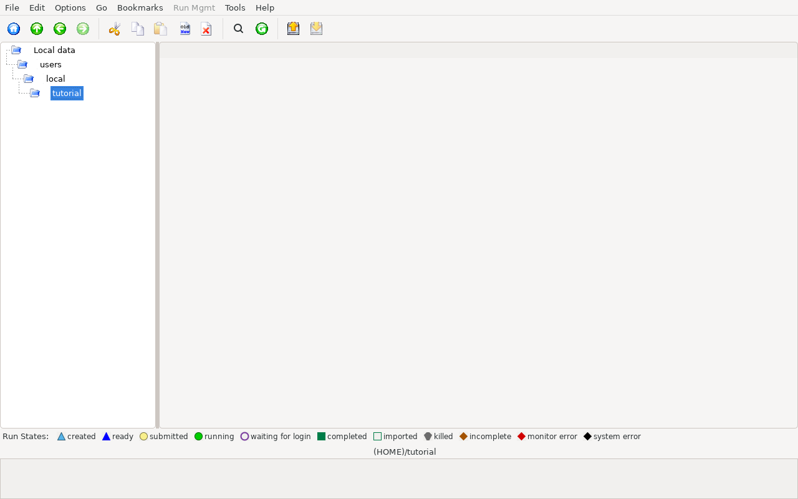
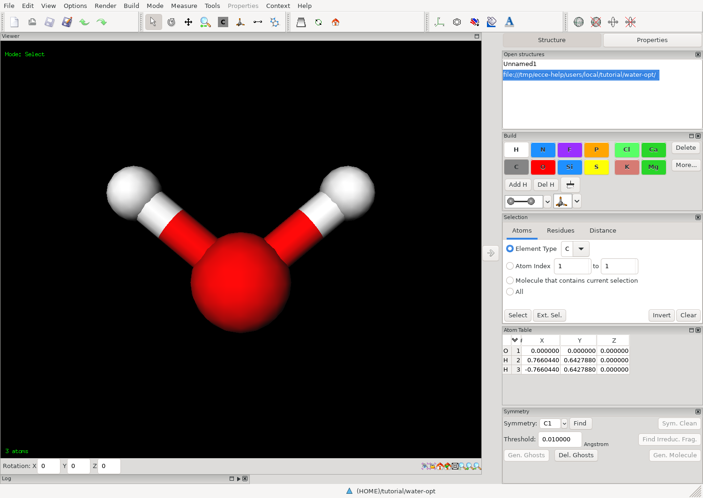
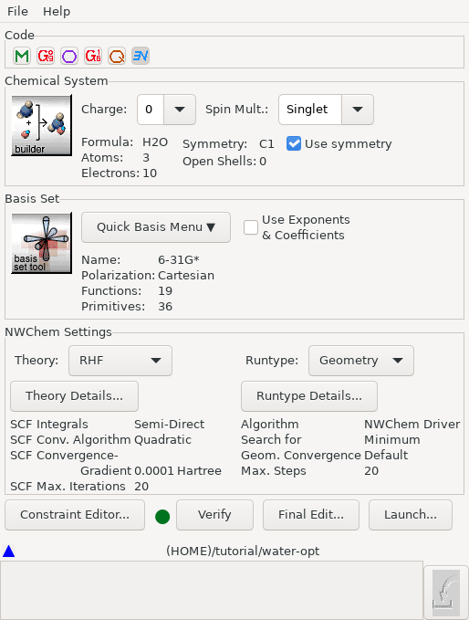
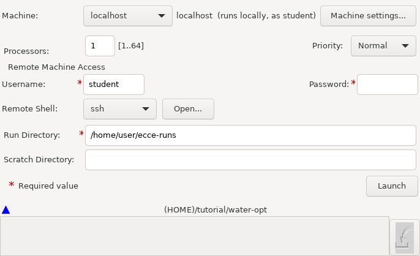
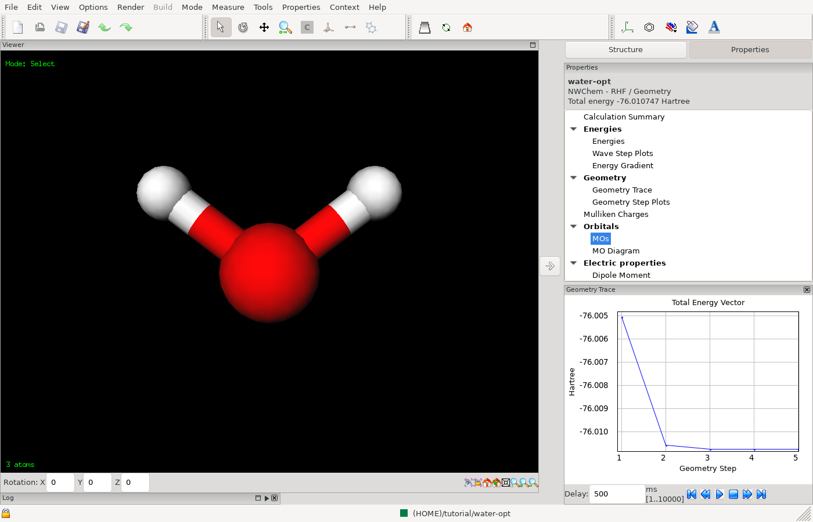

# Your first calculation

In this tutorial you optimise the geometry of a water molecule with NWChem
at the Hartree-Fock level, then look at the energy, the optimisation steps
and, optionally, the vibrational frequencies.

You need:

- ECCE installed and started with `ecce` (see [Installation](installation.md)).
- NWChem installed, so that the command `nwchem` works in a terminal. The
  machine `localhost` runs it for you (see [Machines](machines.md)).

The calculation takes seconds.

## 1. Create a project

A project is a folder that holds calculations. Every calculation belongs to
a project.

1. In the Organizer, select your home folder in the tree on the left.
2. Choose **File > New Project...**.
   You can also right-click the folder and choose **New... > Project...**.
3. In the window "New Project Name", enter `tutorial`.
4. Click **OK**.

The project appears in the tree. Names may contain letters, digits, `.`,
`_` and `-`.

<!-- capture: Organizer with the project "tutorial" selected in the tree -->

## 2. Create a calculation

1. Select the project `tutorial`.
2. Choose **File > New NWChem Calculation...**.
   You can also right-click the project and choose **New... > NWChem
   Calculation...**.
3. In the window "New Calculation Name", enter `water-opt`.
4. Click **OK**.

The calculation appears under the project, with the run state **Created**.
It has no molecule yet.

By default ECCE does not open an editor for the new calculation. (The
Organizer menu **Options** has the entry **Invoke Default Tool at
Creation** if you prefer that.)

## 3. Build the molecule

1. Select `water-opt`.
2. Choose **Tools > Builder...** (Ctrl+B).

The Builder opens on this calculation. (If you have not used the Builder
before, [Looking at a file](looking-at-a-file.md) shows how to open existing
structure files in it.) To add water from the structure
library:

1. In the **Mode Toolbar**, click the button with the tooltip **Import from
   Structure Library**. You can also choose **Mode > Add Structure**
   (Ctrl+7).
2. In the **Structure Library** panel, choose `SimpleStructures` in the
   **Libraries** drop-down, then open the folder `Miscellaneous2` by
   double-clicking it. The button next to the drop-down goes up one
   level.
3. Click `h2o` in the list. A preview appears in the panel.
4. Click in the empty 3D view. The molecule is added there.

If you prefer to draw the molecule yourself:

1. Choose **Mode > Atom** (Ctrl+5), or click **Choose Build Element** in the
   Mode Toolbar.
2. Choose the element O.
3. Click in the empty 3D view to place the oxygen atom.
4. Choose **Build > Add Hydrogen** (Ctrl+F) to complete the valence with
   hydrogen atoms.
5. Choose **Build > Clean** (Ctrl+K) to tidy the geometry.

The default shape of oxygen is Bent, with two open bonds, and **Add
Hydrogen** fills each open bond with a hydrogen atom.

Then save the structure:

1. Choose **File > Save** (Ctrl+S).
2. Close the Builder with **File > Quit** (Ctrl+Q). If it asks "Save Builder
   Changes?", save.

<!-- capture: Builder window, water in ball-and-stick, Structure Library panel closed -->

## 4. Set up the calculation

1. Select `water-opt` in the Organizer.
2. Choose **Tools > Electronic Structure Editor...** (Ctrl+E).

The editor shows what you built under **Chemical System**: **Formula:**
`H2O`, **Atoms:** 3, **Electrons:** 10. **Charge:** is 0 and **Spin
Mult.:** is Singlet, which is correct for water.

Set the rest:

1. Under **Code**, check that the button shows NWChem.
2. In the **NWChem Settings** box, choose `RHF` in **Theory:**.
   `RHF` is restricted Hartree-Fock for a closed-shell molecule.
3. In **Runtype:**, choose `Geometry`. This optimises the geometry.
4. Under **Basis Set**, click **Quick Basis Menu**, then choose `6-31G*`.
   The fields **Name:**, **Polarization:**, **Functions:** and
   **Primitives:** show the chosen basis set.
5. Click **Verify**. This checks the input for obvious problems before you
   submit it.
6. Choose **File > Save** (Ctrl+S).

The buttons **Theory Details...** and **Runtype Details...** open further
options for the chosen theory and run type. The defaults are right for
this calculation.

To see the input file ECCE will send to NWChem, click **Final Edit...**.
The button is enabled when the setup is complete (the run state is
**Ready**). It opens the input file in your text editor: the editor set in
**Edit > Preferences**, otherwise the one named by the `VISUAL` or `EDITOR`
variable. If you close the editor without saving, nothing changes. If you
save a change, ECCE uses your edited file, and later changes in the
Electronic Structure Editor ask before they replace it.

<!-- capture: Electronic Structure Editor with NWChem, RHF, Geometry, 6-31G* set for water -->

## 5. Launch

1. In the editor, click **Launch...**.
   Or select the calculation in the Organizer and choose **Tools >
   Launcher...** (Ctrl+L).
2. In the Launcher, choose `localhost` in **Machine:**.
3. In **Run Directory:**, enter a folder in your home directory where the
   job may run, for example `/home/<you>/ecce-runs`. The field is marked
   `*`, which means it is required. The field starts with the directory
   you used last for this machine. The path must start with `/` or `~`.
   ECCE creates the folder, with its parents, if it does not exist.
4. Leave **Username:** as it is. The field starts with your own user name,
   which runs the job on this computer.
5. Click **Launch**.

The Launcher shows progress messages and, at the end, "Successfully
submitted job."

For `localhost` the Launcher shows **Processors:**, **Priority:**, the
**Remote Machine Access** fields (**Username:**, **Password:**, **Remote
Shell:**), **Run Directory:** and **Scratch Directory:**. It does not show
**Queue:**, **Nodes:**, **Alloc. Account:**, **Wall Time Limit:**,
**Scratch Space:** and **Memory Limit:**: those belong to machines that run
jobs through a batch queue.

<!-- capture: Launcher with Machine: localhost, Run Directory filled, before Launch -->

## 6. Watch the run

Return to the Organizer. The icon of `water-opt` shows its run state.
**Options > Show Run State Legend** (on by default) lists the states and
their icons.

The states you see, in order, are **Submitted**, **Running** and
**Complete**. A calculation that ended with an error is **Failed** or
**Unsuccessful**. You can also select the calculation and read its summary
in the panel next to the tree.

To read the files while the job runs, select the calculation and use the
**Run Mgmt** menu:

- **Tail -f on Output File...** follows the output as it grows, in a
  window of its own over the login ECCE already has for the machine, so
  it does not ask for the password again. **Pause** holds the view while
  new lines keep arriving; **Resume** shows them.
- **View Output File...** and **View Input file...** open the files.
- **View Run Log...** shows ECCE's log of the job.

If the state is **Failed**, open **View Output File...** and read the end
of the file. The most common causes are a wrong path to the code (see
[Machines](machines.md)) and an input error that **Verify** would have
reported.

## 7. Look at the results

1. Select `water-opt`.
2. Choose **Tools > Viewer...** (Ctrl+R).

The Viewer shows the final geometry. (The same Viewer shows the output of a
calculation run elsewhere: see [Looking at a file](looking-at-a-file.md).) Open the results from its
**Properties** menu. Each entry shows or hides a panel.

- **Calculation Summary** lists the theory, run type and basis set, and
  when and where the job ran.
- **Energies** lists the energies of the calculation, including **Total
  Energy**. For an NWChem RHF geometry run the rows are **Nuclear
  Repulsion Energy**, **One-Electron Energy**, **Total Energy** and
  **Two-Electron Energy**, each in Hartree.
- **Geometry Trace** plots one quantity against the geometry step, one point
  for each step. It opens on the **Energy Gradient Magnitude**. To plot the
  energy, right-click the panel and choose **Total Energy Vector**; the
  picture below shows that plot. Click a point on the plot to see the
  molecule at that step, or use the playback control to step through them.
  **Delay:** sets the time between steps during playback.

For a converged optimisation the energy decreases from step to step and
levels off in the last steps, and the gradient falls towards zero.

<!-- capture: Viewer on the finished water-opt calculation, Geometry Trace panel open with the energy plot -->

### Vibrations (optional)

To also compute vibrational frequencies, repeat the tutorial with a second
calculation:

1. In the project, select `water-opt` and choose **Edit > Duplicate for
   Rerun**. Or create a new calculation as in step 2.
2. In the Electronic Structure Editor, choose `GeoVib` in **Runtype:**.
   `GeoVib` optimises the geometry and then computes the frequencies.
   **Duplicate for Rerun** copies the calculation with its structure and
   settings and resets it, ready to launch.
3. Save and launch as before.
4. In the Viewer, choose **Properties > Vibrational Frequencies**.
5. Use the **Table** and **Graph** tabs to see the three frequencies.
6. Select a frequency and click the button with the tooltip **animate
   normal mode** to see the motion. **Scale:** sets the size of the
   displacement and **Delay:** the speed. **stop animation** ends it.

A geometry optimisation that has reached a minimum has no imaginary
frequencies.

## Where next

Change the theory to `RDFT`, or the basis set to `cc-pVTZ`, and compare the
total energy. The next chapters describe each window in more detail.
