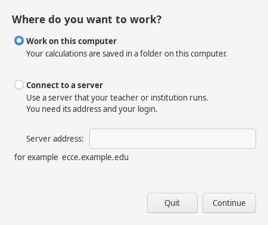
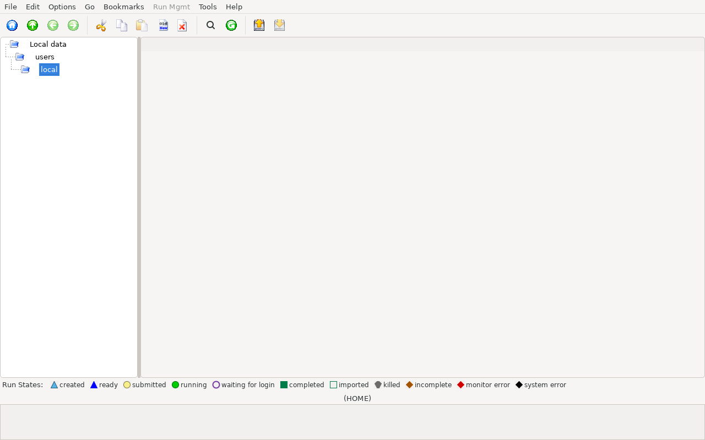

# Installation

ECCE is installed from packages. This page tells you which packages you
need, how to install them, and what you see when you start ECCE for the
first time.

## The two packages

ECCE is split into a client and a server package.

| Package | Contains | Needed when |
|---|---|---|
| `ecce-client` | The windows you use (Organizer, Builder, Launcher, ...), the input generators and output parsers, and the scripts that start your message broker. | Always. |
| `ecce-server` | The data server that stores your projects, the structure and basis-set libraries, and the login check for a shared message broker. | You keep your calculations on a data server on this computer, or you are setting up a server for others. |

Choose one of these:

- **One computer, everything on it.** Install both packages.
- **Your own computer, connecting to a server run by someone else** (for
  example a teaching server). Install only `ecce-client`. Your instructor
  gives you the server address and your login.
- **The server for a group.** Install `ecce-server` on the server computer
  and `ecce-client` on every computer that connects. This is set up by an
  administrator: see *Deployment modes* in `GETTING_STARTED.md` in the ECCE
  source tree.

ECCE does not include a computational chemistry code. To run the example
in this chapter you also need NWChem. Its package is called `nwchem` on Debian, Ubuntu,
Rocky and Fedora.

## Install on Debian or Ubuntu

1. Download the `.deb` files for your system from the ECCE releases page on
   GitHub (`FriendsofECCE/ECCE`). Use the `ubuntu24.04` files on Ubuntu.
2. Open a terminal in the folder with the downloads.
3. Install the packages. For one computer with everything on it:

   ```
   sudo apt install ./ecce-client_<version>_amd64.deb ./ecce-server_<version>_amd64.deb
   ```

   For a client only, name only the `ecce-client` file.
4. Install NWChem:

   ```
   sudo apt install nwchem
   ```

`apt` installs the other packages ECCE needs. Debian's `mosquitto` package
also starts its own system service. ECCE does not use that service and
starts its own broker; you can ignore it.

## Install on Rocky Linux or another RHEL system

1. Enable the EPEL repository, which provides the message broker and the
   3D library:

   ```
   sudo dnf install epel-release
   ```
2. Download the `el9` `.rpm` files from the ECCE releases page.
3. Install them:

   ```
   sudo dnf install ./ecce-client-<version>.el9.x86_64.rpm ./ecce-server-<version>.el9.x86_64.rpm
   ```

   For a client only, name only the `ecce-client` file.

## Install on Fedora

1. Download the `fedora` `.rpm` files from the ECCE releases page.
2. Install them:

   ```
   sudo dnf install ./ecce-client-<version>.fedora.x86_64.rpm ./ecce-server-<version>.fedora.x86_64.rpm
   ```

   For a client only, name only the `ecce-client` file.

The Debian packages are the ones that are tested. The Ubuntu, Rocky and
Fedora packages are built on those systems but have had less testing.

## Start ECCE

Start ECCE from a terminal with:

```
ecce
```

Always start ECCE with `ecce`. Do not start `ecce-builder` or the other
`ecce-<name>` commands directly: `ecce` first starts the services the
windows need. The Organizer opens first. Open the other windows from it.

The `ecce-client` package also adds an **ECCE** entry to the applications
menu. It starts the same `ecce` command.

## What you see the first time

### The first question

If nothing on your computer tells ECCE where your work goes, ECCE asks
once, in a window called "Welcome to ECCE":



- **Work on this computer** keeps your calculations in a folder on this
  computer, `~/.ECCE-local`. Choose this if you work alone.
- **Connect to a server** uses a server that your teacher or institution
  runs. Type its address, for example `ecce.example.edu`, and click
  **Continue**. ECCE then shows the login window; use the user name and
  password you were given.

Click **Continue** to confirm. ECCE remembers your choice and does not ask
again. **Quit** closes ECCE without choosing anything.

ECCE does not ask if it is already set up: on a computer that has a server
configured by its administrator, on a server itself, or when you have used
ECCE here before.

If ECCE cannot connect, it tells you in the same window. Check the address
and your network connection, then click **Continue** again.

If the server proves who it is with a certificate that your computer already
trusts, ECCE connects without further questions. Otherwise ECCE remembers
the certificate the server shows the first time you connect. If that
certificate ever changes, ECCE does not log you in and says so; ask the
server's administrator, then choose **Edit > Change Server...** and connect
again.

To change your mind later, choose **Edit > Change Server...** in the
Organizer. The window says where ECCE works now, and which folder holds your
calculations if it is this computer. The change applies the next time you
start ECCE. Your calculations are not copied from one place to the other.

If you did not choose a server, ECCE keeps your projects and calculations in
one of two places on this computer.

### On a data server (the default)

ECCE starts a data server for you. Before your first start, create your
account on it:

1. Start the data server:

   ```
   ecce-dataserver-start
   ```
2. Create your account:

   ```
   ecce-dataserver-adduser
   ```

   Answer the prompts for your name, a user name and a password. Use your
   Unix user name as the user name; the login window offers it by default.
3. Start ECCE with `ecce`.
4. In the login window ("Please enter your data server user name and
   password:"), check that **Server:** is the server you expect.
5. Enter your **User name:** and **Password:**.
6. Click **OK**.

If you tick **Save Passwords Between Invocations**, ECCE stores the
password and does not ask again. The title of the login window is
"ECCE Authentication".

If the account does not exist, ECCE shows "There is no account for ... on
this ECCE data server". Create the account with `ecce-dataserver-adduser`
and start again.

If you connect to someone else's server, run `ecce-remote-setup
<server-host>` once, then start with `ecce -remote`. Your administrator
gives you the host name.

### In a folder on your computer (local data mode)

In local data mode there is no data server and no login. Your projects and
calculations are stored in an ordinary folder, by default `~/.ECCE-local`.
This suits one person on one computer.

To use it from the first start:

1. Start ECCE with the folder named in the environment:

   ```
   ECCE_LOCAL_DATA=$HOME/.ECCE-local ecce
   ```
2. The Organizer opens without a login window.

To make it permanent:

1. In the Organizer, choose **Edit > Preferences**.
2. Open the **Data folder** tab.
3. Tick **Keep calculations in a folder on this computer, not on a data
   server**.
4. To use another folder, click **Change...** next to **Folder:** and
   choose it.
5. Close the window and restart ECCE. The setting applies from the next
   start.

Changing mode copies nothing. The calculations of the other mode stay where
they are, and the new mode starts empty. The variable `ECCE_LOCAL_DATA`
overrides the setting in Preferences.

Local mode reads the structure and basis-set libraries from the
`ecce-client` package. It does not need `ecce-server`.



<!-- capture: Organizer window, freshly started in local data mode, nothing selected, Run State Legend visible -->

## Next steps

For administrators and central servers, see `GETTING_STARTED.md`: it covers
accounts for a class, the shared broker, and building from source.

To look at a structure or at existing results first, continue with
[Looking at a file](looking-at-a-file.md). To run calculations, continue with
[Machines](machines.md).
