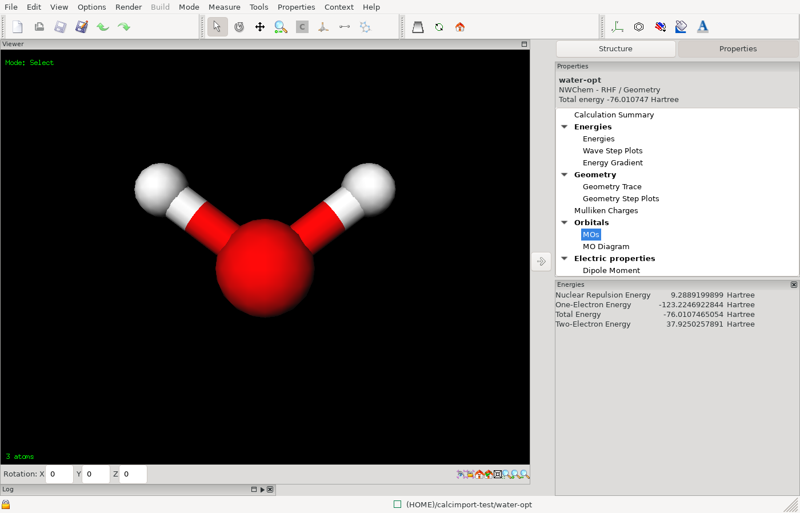

# Looking at a file

You can use ECCE without a compute machine and without any computational
chemistry code installed. This page shows two things you can do right after
installation: open a structure you already have, and look at the results of
a calculation that was run elsewhere. Both use the Builder, the Organizer
and the Viewer, which you also use in [Your first calculation](first-calculation.md).

You need ECCE started with `ecce` (see [Installation](installation.md)).

## Open a structure

The Builder reads structure files in these formats:

| Format | File extensions |
|---|---|
| XYZ | `.xyz` |
| PDB | `.pdb`, `.ent` |
| Biosym/Accelrys CAR | `.car` |
| ECCE MVM (ECCE's own format) | `.mvm` |

### Start the Builder without a calculation

1. In the Organizer, choose **File > New Structure...** (Ctrl+N).

The Builder opens on an empty structure that belongs to no calculation.
You can also open the Builder on a calculation, as in
[Your first calculation](first-calculation.md).

### Load a file into the Builder

1. In the Builder, choose **File > Import Chemical System...**.
2. In the file window ("Load Chemical System into Current Context"), choose
   **Local Filesystem** in the server list at the top-left. The same list
   offers the data servers ECCE knows about.
3. Go to the folder with your file. **Files of type:** lists the formats
   above; "All Supported Types" shows all of them.
4. Select the file and click **OK**.

The structure is added to what is already in the Builder, so start from an
empty structure if you want only the file.

What happens next depends on the format:

- XYZ: ECCE asks for the units of the coordinates (the file does not
  record them). [TO CHECK: the labels of the units window and its
  choices; the code offers angstroms, Bohr, picometers and nanometers.]
- PDB: if the file has several models, alternate locations or chains,
  ECCE asks which to use. [TO CHECK: the labels of this window.]
- CAR and MVM: loaded without a question.

For XYZ, PDB and CAR files ECCE works out the bond orders from the
coordinates. MVM files carry their own bonds.

To work on a file directly instead of adding it to a structure, choose
**File > Open in New Context...** (Ctrl+O) and pick the file the same way.
The Builder opens it as its own context. [TO CHECK: that this works for a
file on the local file system, and where **File > Save** writes the changes.]

The same window also lists `.cube` and `.trj` files. A trajectory (`.trj`
or multi-frame `.xyz`) and a Gaussian cube file open with **Open in New
Context...**; **Import Chemical System...** reads only the four formats in
the table. [TO CHECK: what **Open in New Context...** shows for each.]

### Build from the structure library

The Structure Library holds ready-made molecules and fragments. It has the
folders `SimpleStructures` (organised by compound class, for example
`Alicycles`, `Amines`, `Sugars`, `Vitamins`), `Amino_Acids`, `DNA_Bases` and
`RNA_Bases`. Use it as in step 3 of
[Your first calculation](first-calculation.md#3-build-the-molecule):

1. Choose **Mode > Add Structure** (Ctrl+7).
2. In the **Structure Library** panel, open a folder and click a
   structure. A preview appears.
3. Click in the empty 3D view to add it. To attach it to a structure that
   is already there, select the atom to bond it to first. [TO CHECK: the
   selection step needed to join two fragments.]

You can draw atoms with **Mode > Atom** (Ctrl+5), and finish with **Build >
Add Hydrogen** and **Build > Clean**, as in the first calculation.

## Look at a finished calculation

If you have the output file of a calculation that ran elsewhere, ECCE can
read it and show the results as if it had run the job.

### Which outputs can be imported

ECCE recognises the code from a marker line in the output file:

| Code | Output file |
|---|---|
| NWChem | The output of a run (the file contains "Northwest Computational Chemistry Package"), or ECCE's formatted output (`ecce_print`). |
| Gaussian 16, 09, 03, 98 | The output (log) file. The version is read from the line "Gaussian NN, Revision". |
| ORCA | The output of a run (the file contains the "O   R   C   A" banner). |

Output files of other codes are not recognised and the import ends with
"Unrecognized output file format--cannot import." MOPAC and Quantum
ESPRESSO outputs cannot be imported, although ECCE can run those codes.
GAMESS-UK, Amica and MOLCAS are not recognised either. [TO CHECK: that the
Gaussian 03 and 98 importers still work; those codes are retired.]
[TO CHECK: the ORCA importer reads only ORCA outputs for the keyword
vocabulary ECCE itself generates (RHF, UHF, RKS, UKS with Opt, Freq,
EnGrad) and recovers a basis set only when it is given by name.]

### Import the file

1. In the Organizer, select the project that should hold the calculation.
   If you select a calculation or something inside a project, ECCE uses
   the project above it. If nothing selected lies inside a project, the
   import ends with "Can't access or write to the specified parent project
   for the import." Create a project first, as in step 1 of
   [Your first calculation](first-calculation.md#1-create-a-project).
2. Choose **File > Import Calculation from Output File...**.
3. In the window "ECCE Import Calculation from Output File", select the
   output file and click **OK**. The window opens in the folder you used
   last, or in your home folder.

ECCE names the new calculation after the job. For NWChem it uses the name in
the `start` (or `restart`) line of the input echoed in the output, and for
Gaussian the job title, with characters other than letters, digits, `.`
and `_` replaced by `_`. Otherwise it uses the name of the file. [TO CHECK:
the name an ORCA import gets, and what happens when the name already
exists in the project.]

The message line shows "Calculation output currently being imported into
<project>/<calculation>." The calculation appears in the tree. The Viewer
can be slow to respond until the import has finished. [TO CHECK: how the
run state of an imported calculation is shown.]

Import needs the machine `localhost` to be registered, which it is by
default (see [Machines](machines.md)). It does not run any code. It needs
Perl and the ECCE parser scripts that come with `ecce-client`.

The Builder has the same entry under **File > Import Calculation from
Output File...**. It puts the calculation in your home folder instead of a
project, and opens it in the Builder.

### Look at the results

1. Select the imported calculation in the Organizer.
2. Choose **Tools > Viewer...** (Ctrl+R).

The Viewer shows the geometry in the output: the final geometry for an
optimisation. Open results from the **Properties** menu; the menu lists
only what ECCE found in the file.

- **Calculation Summary**: code, theory, run type, basis set and run
  statistics.
- **Energies**: the energies read from the output, including **Total
  Energy**.
- **Geometry Trace**: the energy and geometry at each step of an
  optimisation. Click a point on the plot to see the molecule at that step.
- **Mulliken Charges**: the atomic charges.
- **Dipole Moment**: the dipole.
- **MOs**: the molecular orbitals, described below.
- **MO Diagram**: the orbitals drawn as an energy level diagram. [TO CHECK:
  that the panel is labelled experimental; it is documented as experimental
  in the release notes.]
- **Vibrational Frequencies**: the frequencies and normal modes, described
  below.

These entries appear when the code and the run type produced them. An
energy-only calculation has no **Geometry Trace**, and a calculation
without a frequency run has no **Vibrational Frequencies**. Which entries
each code supplies is listed in its parse specification
(`scripts/parsers/*.desc`).

<!-- capture: Viewer on an imported calculation with the Properties menu open -->

#### Orbitals

1. Choose **Properties > MOs**. The panel lists the orbitals in a table, one
   row for each. [TO CHECK: the column headings and whether the rows are
   sorted by energy.]
2. In the choice next to **Compute**, choose **MO**, **Density** or **Spin
   Density**.
3. Select an orbital row.
4. Click **Compute**. ECCE calculates the orbital on a grid and draws its
   surface in the 3D view, with different colours for the two signs.
   [TO CHECK: whether a progress window is shown.]
5. Use the toolbar buttons of the panel to change how the surface is drawn
   (for example **Contour**), and **View Coeff...** to read the coefficients
   of the selected orbital.

Orbitals need the molecular orbital coefficients and the basis set in the
output. If the output has no orbitals, **MOs** is missing from the menu.
[TO CHECK: whether each code's output has them by default; NWChem
needs the `ecce_print` output or the `movecs` file, ORCA's default output
may not print them.]

#### Vibrations

1. Choose **Properties > Vibrational Frequencies**.
2. Use the **Table** and **Graph** tabs to see the frequencies.
3. Select a frequency and click the button with the tooltip **animate
   normal mode**. **Scale:** sets the size of the displacement and
   **Delay:** the speed. **stop animation** ends it.

See [Your first calculation](first-calculation.md#vibrations-optional) for
the same steps on a calculation you ran yourself.

## Where the data is kept

Structures you save and calculations you import are stored in your projects,
in the place ECCE keeps your data: the data server, or the local folder if
you use local data mode (see [Installation](installation.md)). The Organizer
tree shows them. [TO CHECK: that ECCE leaves your original structure file or output file
unchanged.]

A structure opened with **Import Chemical System...** is not saved until you
choose **File > Save** in the Builder. [TO CHECK: what **File > Save** and
**File > Save As...** offer for a structure that belongs to no calculation.]

## Next steps

To run a calculation yourself, continue with [Machines](machines.md) and
[Your first calculation](first-calculation.md).
