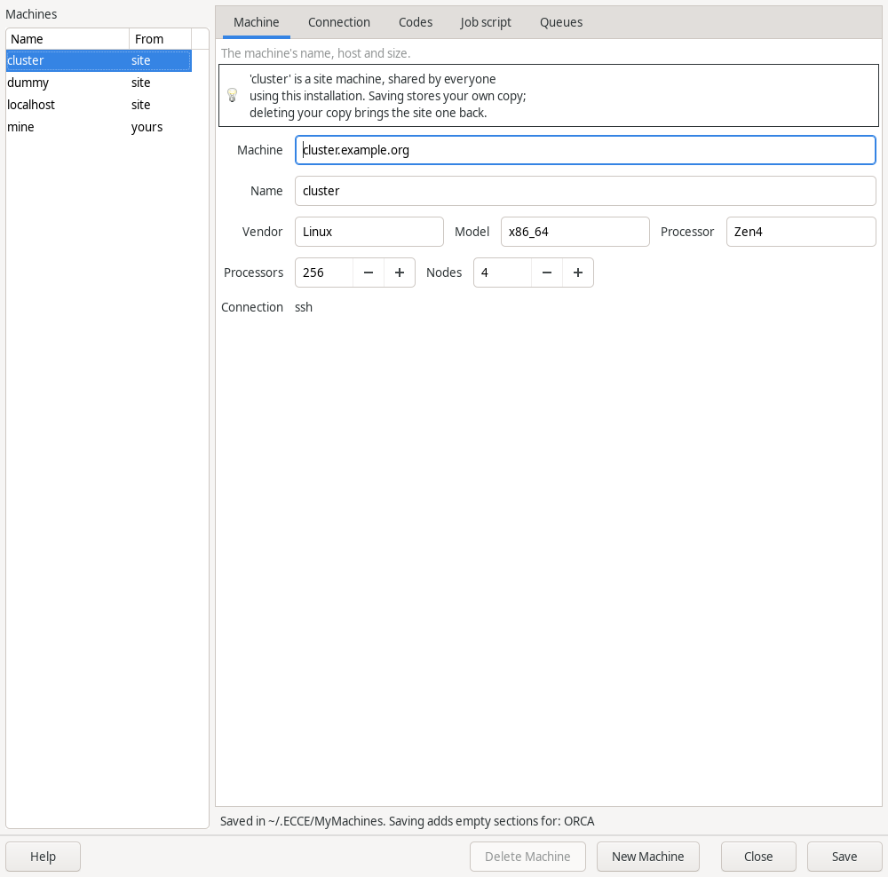

# Machines

A calculation runs on a *machine*. A machine is the computer you are
sitting at, or a workstation or cluster that ECCE reaches over ssh. ECCE
needs to know three things about a machine: that it exists, where the
codes are installed on it, and (for a cluster) which queues it has.

## Your own computer: `localhost`

The machine `localhost` is registered for you. It means the computer ECCE
is running on. Jobs run directly there, with no batch system, and nothing
is sent over ssh.

At the first start ECCE copies a template to `~/.ECCE/CONFIG.localhost`.
It names the codes by their plain command names:

```
NWChem: nwchem
Gaussian-16: g16
Gaussian-09: g09
ORCA: orca
MOPAC: mopac
QuantumESPRESSO: pw.x
perlPath: /usr/bin/perl
```

ECCE finds each code through the `PATH` of the shell that runs the job. A
code installed from a distribution package, such as `sudo apt install
nwchem`, is already on the `PATH`, so nothing more is needed.

ECCE does not overwrite this file once it exists. If your administrator
has put a `CONFIG.localhost` in the site configuration
(`/opt/ecce/siteconfig`), ECCE uses that one and does not create yours.

### A code that is not on the `PATH`

If a code is installed in its own directory, replace the plain name with
the full path to the program:

1. Open `~/.ECCE/CONFIG.localhost` in a text editor.
2. Find the line that starts with the code's name, for example `ORCA:`.
3. Replace the value with the full path. For example:

   ```
   ORCA: /opt/orca/orca_6_1_1/orca
   ```
4. Save the file.

The Launcher offers a machine for a code when the machine's entry names the
code, or when its CONFIG file gives the path of that code. The next job you
launch uses the new path. A job fails with "Path for
<code> not found" if the code you run has no line in this file.

You can also set the path in the Machine Registration window, in the
**Applications** box (see below). [TO CHECK: that a path entered there for
`localhost` is written to `~/.ECCE/CONFIG.localhost` and is used for the
run.]

### A code that needs environment variables

Some codes need environment variables set before they run. Add them to the
same file in a block named after the code with `Environment` appended. Each
line is a variable name and its value; ECCE exports them in the job script
before starting the code, and appends to variables whose name contains
`PATH` instead of replacing them.

For Gaussian 16, ECCE already sets `GAUSS_EXEDIR` and `LD_LIBRARY_PATH` to
the directory of the `Gaussian-16:` path. It needs `g16root` in addition:

```
Gaussian-16: /opt/gaussian/g16/g16
Gaussian-16Environment {
  g16root /opt/gaussian
  GAUSS_SCRDIR /scratch
}
```

Further variables, such as a processor-specific setting a site uses for
Gaussian on AMD processors, go into the same block. No wrapper script is
needed.

## Machine Registration

Machine Registration is where you add a machine, set the code paths and
define its queues. Open it in any of these ways:

- In the Organizer, choose **Tools > Register Machines...**.
- In the Launcher, choose **Job > Register Machines...**.
- From a terminal, run `ecce -machine`. This opens only Machine
  Registration, without a session.

The list on the left shows the machines you have registered. The machines
supplied with ECCE, `localhost` and `dummy`, are shared by everyone who
uses the installation and are not in your list. If you select one of them
elsewhere and choose to register it, the form shows its settings; edit them
and click **Add/Change** to save your own copy under the same name. Your
copy is used instead of the shared one. **Delete Machine** removes your
copy and brings the shared one back.



<!-- capture: Machine Registration window with one cluster registered, Applications and Queues boxes visible -->

### Register a cluster

1. Open Machine Registration.
2. Click **Clear Form**.
3. In **Machine:**, enter the fully qualified host name, for example
   `login.hpc.example.edu`.
4. In **Name:**, enter a short name for the list, for example `hpc`.
5. Fill in **Vendor:**, **Model:** and **Processor:** as you wish.
   [TO CHECK: whether these three fields are required.]
6. Set **Total # Processors:** and **# Nodes**.
7. Tick **ssh**.
8. In the **Applications** box, enter the full path to each code on that
   machine, for example `NWChem:` `/opt/nwchem/bin/nwchem`. Leave the codes
   you do not use empty.
9. In the **Misc. Paths** box, enter the path to Perl in **Perl 5:** if it
   is not the default.
10. Define the queues (next section).
11. Click **Add/Change**.
12. Click **Close**.

ECCE connects to ssh machines with its own ssh library. It asks for the
password, the verification code or an unknown host key in dialogs, so you
do not need a terminal. If the machine needs a two-factor login that ECCE
cannot answer, use the `dummy` machine instead (see below).

Code settings that are not paths, such as `module load` lines, go in
`~/.ECCE/CONFIG.<name>`. `GETTING_STARTED.md` describes the file and the
variables it can use.

### Queues

A queue is a batch queue on the cluster, with limits ECCE checks before a
job is submitted. You define queues in the **Queues** box of Machine
Registration.

1. In **Queue Manager:**, choose the batch system of the cluster, for
   example Slurm or PBS. Choose Shell if the machine has none.
2. Tick **Allocation Accounts Used** if the cluster charges jobs to an
   account.
3. In **Queue Name:**, enter the name of the queue.
4. Set **Min Processors:** and **Max Processors:**.
5. Set **Max Wall Time:** in minutes (`min`). 0 means no limit.
6. Set **Max Memory:** in GB. 0 means no limit.
7. Set **Min Scratch:** in MB.
8. Click **Add/Change Queue**.
9. Repeat from step 3 for each further queue.
10. Click **Add/Change** to save the machine.

To change a queue, choose it in **Queues:**, edit the fields and click
**Add/Change Queue**. **Remove Queue** deletes the chosen queue and
**Clear All Queues** deletes all of them.

[TO CHECK: whether **Add/Change Queue** saves on its own or only when
**Add/Change** is clicked for the machine.]

Your queue definitions are stored in `~/.ECCE/Queues` and in a file per
machine, `~/.ECCE/<name>.Q`. They are added to the queues defined for the
whole installation. You normally do not edit these files by hand.

## The `dummy` machine: submitting by hand

Some clusters cannot be reached by ECCE, for example because they require
two-factor authentication. The `dummy` machine is for these. ECCE never
contacts it. Launching on `dummy` creates the input file and the submit
script on your computer and stops.

1. Set up the calculation as usual.
2. In the Launcher, choose `dummy` in **Machine:**.
3. Click **Launch**.
4. ECCE reports "Input files generated in <directory>", and that it will
   not submit the job. Copy that directory to the cluster.
5. Submit the job there yourself.
6. When the job has finished, copy the output file back.
7. In the Organizer, choose **File > Import Calculation from Output
   File...** to bring the results into ECCE (see
   [Looking at a file](looking-at-a-file.md)). [TO CHECK: the dialog that
   follows and which calculation the output is attached to.]

## Job submission settings

Register Machines, Connection tab, under **Advanced > Job submission**.

By default ECCE does everything itself: it logs in to the machine, copies
the input and job script, submits the job, follows it, and copies the output
back. The Connection tab shows this as "How jobs reach this machine: ECCE
submits the job". Two settings change it for machines where that is not
possible. They exclude each other: ticking one disables the other. When
either is in effect, the line shows a warning symbol and the name of the
mode, and Advanced opens when you select the machine.

### Submit jobs interactively

**Use it when** the site does not allow automated submission, for example
because job submission must be done from an interactive login.

**ECCE does:** logs in, creates the run directory, and copies the input and
the job script into it.

**You do:** log in to the machine yourself, submit the job script from the
run directory with the scheduler's own command (for example `sbatch`), and,
when ECCE asks, type the job ID into the dialog. ECCE then follows the job
and copies the output back as usual.

**Setting:** `userSubmit: true` in `CONFIG.<machine>`.

### Don't submit; only make the files

**Use it when** ECCE cannot log in to the machine at all, for example when
the machine requires two-factor authentication.

**ECCE does:** writes the input and the job script on this computer and
stops. It never contacts the machine, and says which directory holds the
files.

**You do:** copy the files to the machine, submit the job there, and, once
it has finished, import the output with Organizer > File > Import
Calculation from Output File...

**Setting:** `noRemoteAccess: true` in `CONFIG.<machine>`. If both keys are
present, `noRemoteAccess` takes effect.

### Where the settings are stored

A change is stored in your own `~/.ECCE/CONFIG.<machine>`. A site can set
the same keys in `siteconfig/CONFIG.<machine>`; the tag next to the line
shows "from site" in that case. The undo button next to the tag removes
your setting and returns to the site's. Ticking neither box removes the
key (or, if the site sets one, writes `false` for it), which is the normal
mode.
