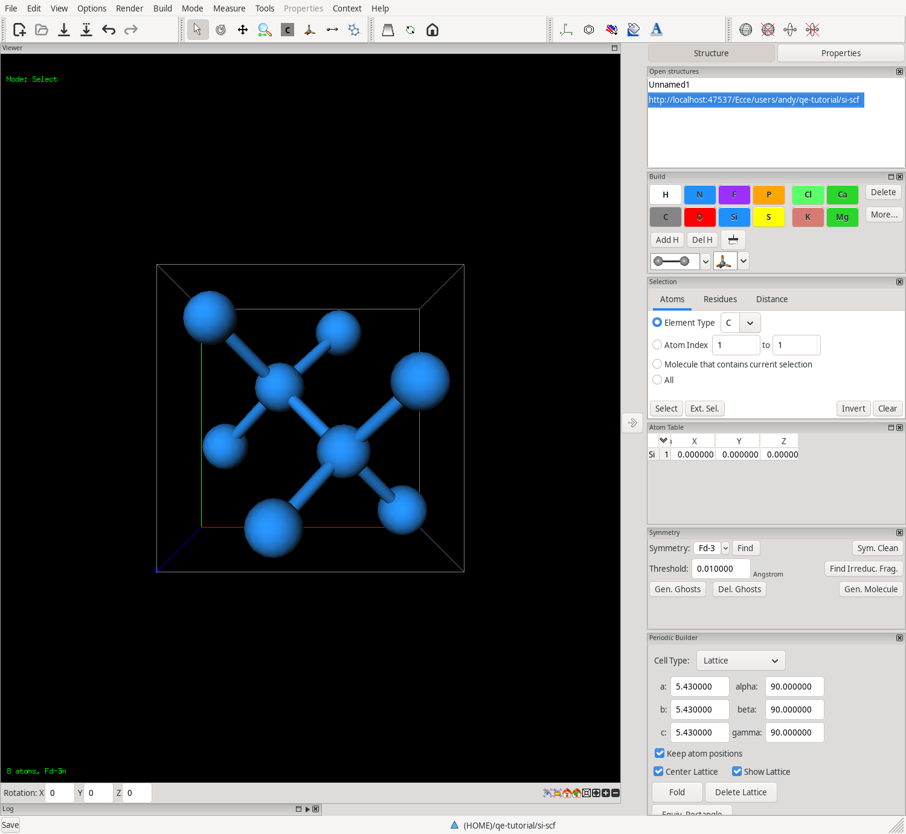
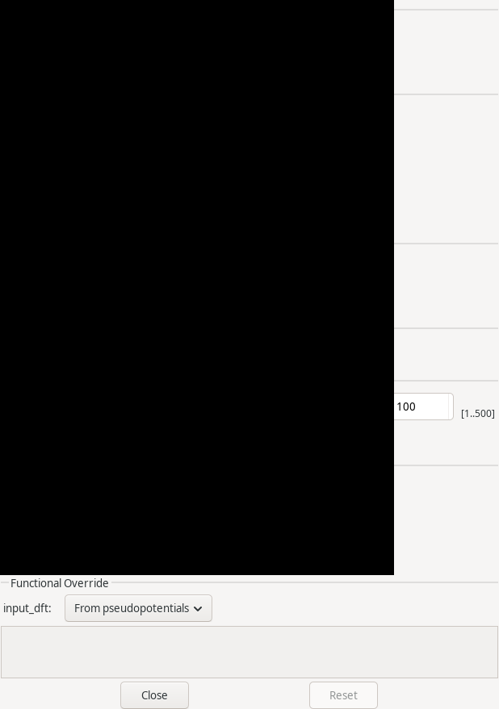
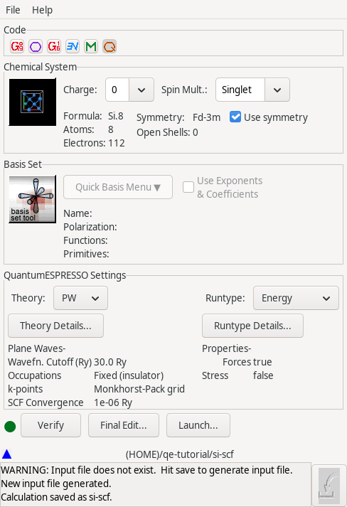
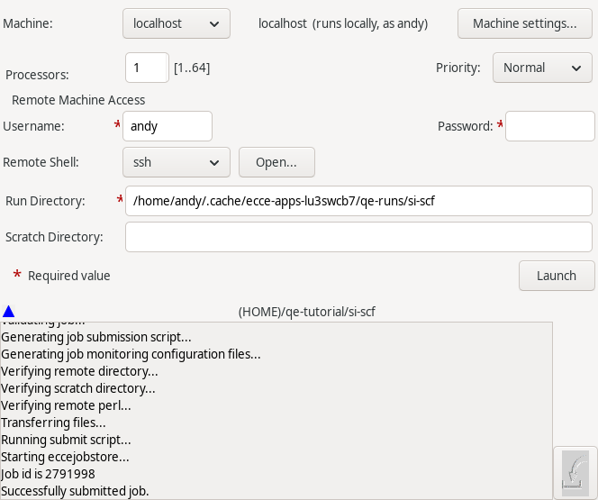
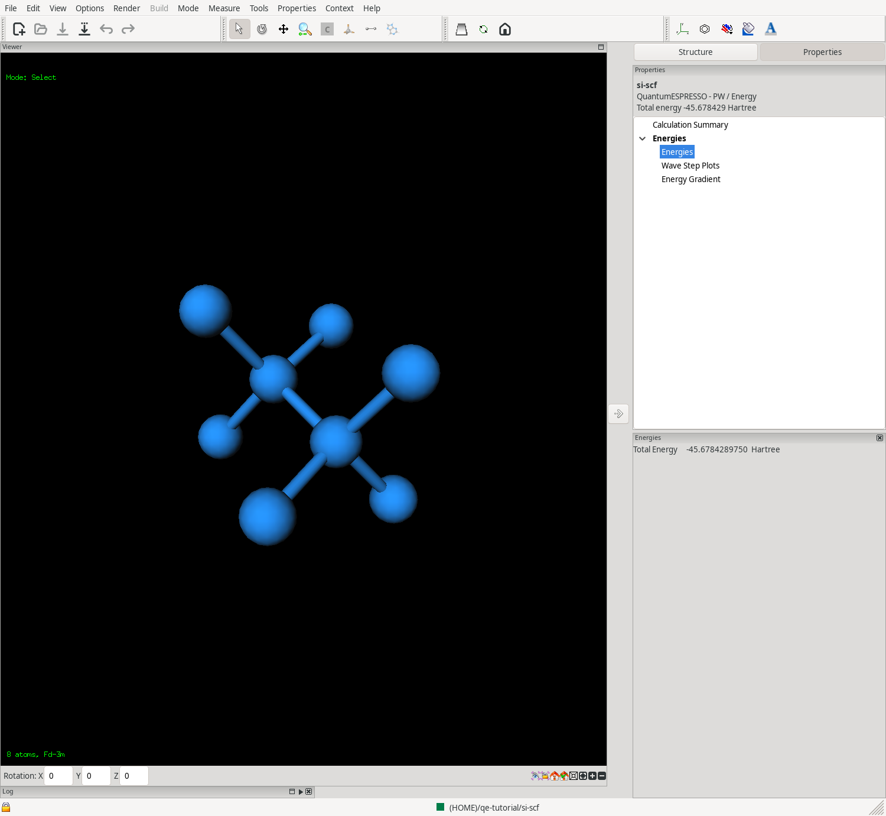
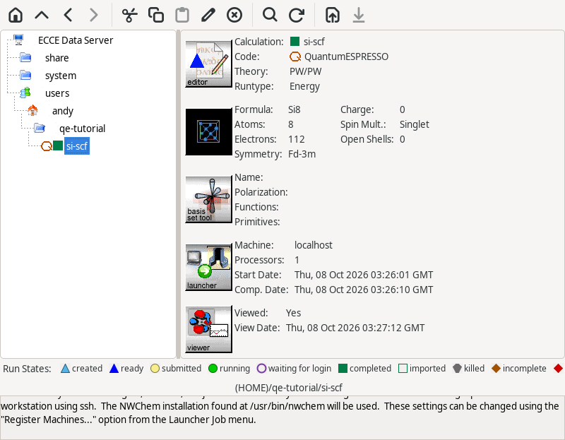
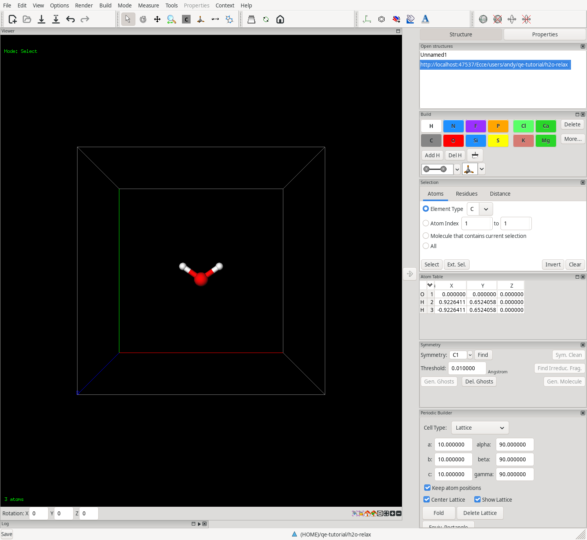
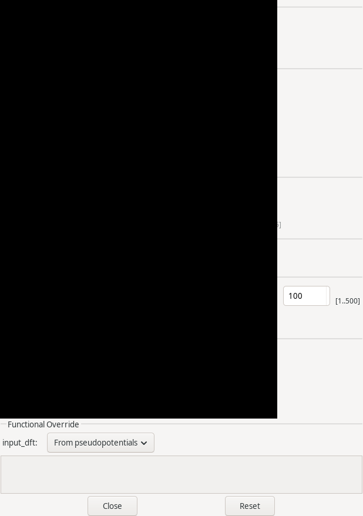
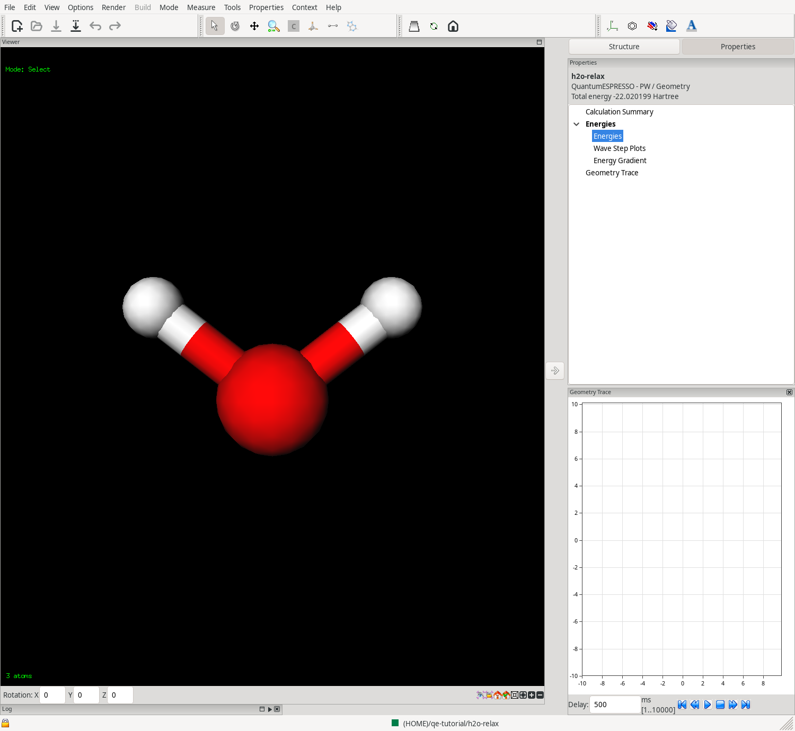

# Your first Quantum ESPRESSO calculation

Quantum ESPRESSO (QE) computes the energy of a crystal, a surface or a
molecule in a box with plane waves. This tutorial runs two small
calculations with its program `pw.x`:

1. the energy of bulk silicon, built from its space group;
2. the geometry optimisation of a water molecule in a box, with its
   energy and the steps of the optimisation.

Silicon takes about half a minute and the water optimisation a few
minutes. Read [Your first calculation](first-calculation.md) first if you
have not used the Organizer, the Builder and the Launcher before: this
page does not repeat what they explain there.

## What you need

- ECCE installed and started with `ecce` (see [Installation](installation.md)).
- Quantum ESPRESSO and its pseudopotentials. On Debian:

  ```
  sudo apt install quantum-espresso quantum-espresso-data-sssp
  ```

  `quantum-espresso` installs `pw.x` in `/usr/bin`. The second package
  installs the SSSP set of pseudopotentials, one file for each of 103
  elements, in `/usr/share/espresso/pseudo`. A pseudopotential replaces the
  core electrons of an atom, so the calculation only treats the valence
  electrons. Check both:

  ```
  which pw.x
  ls /usr/share/espresso/pseudo | head -3
  ```
- The machine `localhost` knows the program by its plain name. The file
  `~/.ECCE/CONFIG.localhost` that ECCE creates at its first start has the
  line `QuantumESPRESSO: pw.x`. If you started ECCE before Quantum
  ESPRESSO was supported, and your file has no such line, add it (see
  [Machines](machines.md)); a job fails with "Path for Quantum ESPRESSO not
  found" without it.

ECCE chooses the pseudopotential of each element for you, from the
directory in **Theory Details**. You do not type file names.

## A word on units and settings

- Energies are in Hartree in ECCE. Quantum ESPRESSO prints Rydberg:
  1 Hartree is 2 Ry.
- The basis set is a **Wavefunction Cutoff**, in Ry. It plays the role of the
  basis set in other codes. A larger cutoff is more accurate and slower. The
  SSSP project publishes a recommended cutoff for each of its pseudopotentials:
  30 Ry for silicon and 60 Ry for hydrogen are the values used below. For
  silicon, going from 30 to 45 Ry changes the energy by 0.2 mRy (for two
  atoms).
- The **Charge Density Cutoff** is separate. Leave its box unticked: ECCE then
  writes 8 times the wavefunction cutoff for the ultrasoft and PAW
  pseudopotentials of the SSSP set, as they recommend, and 4 times for
  norm-conserving ones.
- A calculation needs a unit cell. A crystal has its own. For a molecule you
  make a box around it, large enough that the molecule and its images in the
  neighbouring cells stay far apart.

## Part 1: bulk silicon

Silicon has the diamond structure, space group Fd-3m (number 227), with one
atom at the origin and a cubic cell of 5.43 angstrom. The Periodic Builder
makes the atoms of the whole cell from that one atom and the space group. The
cell it makes is the cubic cell with 8 atoms. (A smaller cell with 2 atoms
describes the same crystal, but the Periodic Builder gives the cubic one.)

### 1. Create a project and a calculation

1. In the Organizer, select your home folder in the tree on the left.
2. Choose **File > New Project...**, enter `qe-tutorial` and click **OK**.
3. Select the project and choose **File > New Quantum ESPRESSO
   Calculation...**. Enter `si-scf` and click **OK**.

The calculation appears under the project, in the run state **Created**.

### 2. Build the crystal

1. Select `si-scf` and choose **Tools > Builder...** (Ctrl+B).
2. In the **Build** panel on the right, click the element button `Si`. In
   the shape drop-down at the bottom of the panel, choose the first shape,
   the single atom with no open bonds.
3. Choose **Mode > Atom** (Ctrl+5) and click once in the empty 3D view. One
   silicon atom appears. The status line of the view says `1 atoms`.
4. Choose **Tools > Periodic Builder**. The panel opens in the right-hand
   column. Click **Create Lattice**.
5. Set the cell **before** you generate atoms. **Cell Type:** is `Lattice`.
   Enter `5.43` in **a:**, **b:** and **c:**, pressing Enter after each, and
   check that **alpha:**, **beta:** and **gamma:** are `90`.
6. In the box next to **Sym. Group**, choose `Fd-3m`. Click **Generate**.

The view shows the cubic cell with 8 atoms and the status line says `8 atoms,
Fd-3m`.



<!-- capture: Builder with the generated silicon cell and the Periodic Builder panel -->

The boxes **Keep atom positions**, **Center Lattice** and **Show Lattice**
can stay as they are. **Keep atom positions** keeps the atoms where they are
when you change the cell; for a molecule in a box that is what you want, for
a crystal you set the cell before the atoms exist, so it makes no difference.

7. Choose **File > Save** (Ctrl+S) and close the Builder with **File >
   Quit** (Ctrl+Q).

### 3. Set up the calculation

1. Select `si-scf` in the Organizer and choose **Tools > Electronic
   Structure Editor...** (Ctrl+E).

The editor shows **Formula:** `Si8`, **Atoms:** 8 and **Symmetry:** `Fd-3m`.
**Electrons:** shows 112, the electrons of eight silicon atoms with all their
electrons. `pw.x` treats 4 valence electrons per atom, 32 in all.
The code buttons at the top show Quantum ESPRESSO selected. The **Basis Set**
box is greyed out: there is no basis set, only a cutoff.

2. Check that **Theory:** is `PW` (plane waves) and **Runtype:** is `Energy`.
3. Click **Theory Details...**. The window has these boxes. The defaults suit
   silicon, so you only look:

   | Box | Field | Value |
   | --- | --- | --- |
   | **Plane-Wave Basis** | **Wavefunction Cutoff:** | `30.0` Ry |
   | | **Charge Density Cutoff:** | box not ticked |
   | **Brillouin Zone Sampling** | **k-points:** | `Monkhorst-Pack grid` |
   | | **Grid n1:**, **n2:**, **n3:** | `4`, `4`, `4` |
   | | **Offset s1:**, **s2:**, **s3:** | `0`, `0`, `0` |
   | **Occupations** | **Occupations:** | `Fixed (insulator)` |
   | **SCF Convergence** | **Energy Convergence:** | `1e-06` Ry |
   | **Pseudopotentials** | **Directory:** | `/usr/share/espresso/pseudo` |

   A crystal is computed at a grid of points in its reciprocal cell, the
   *k-points*. A grid of 4 by 4 by 4 is a reasonable first choice for an
   insulator with this cell. Click **Close**.



<!-- capture: Theory Details window with the defaults -->

4. Click **Verify**, then choose **File > Save** (Ctrl+S).
5. To see what ECCE gives `pw.x`, click **Final Edit...** and read the file,
   then close the editor without saving. The file has the cell
   (`CELL_PARAMETERS`), the 8 atoms (`ATOMIC_POSITIONS`), the pseudopotential
   (`ATOMIC_SPECIES`), the grid (`K_POINTS`) and `ecutwfc = 30.0` and
   `ecutrho = 240`.



<!-- capture: Electronic Structure Editor with PW, Energy, ready to launch -->

### 4. Launch

1. In the editor, click **Launch...**.
2. In the Launcher, choose `localhost` in **Machine:**.
3. In **Run Directory:**, enter a folder in your home directory, for example
   `/home/<you>/ecce-runs`.
4. Click **Launch**.

The Launcher ends with "Successfully submitted job." You can close it: ECCE
goes on watching the job. The calculation takes from half a minute to a few
minutes, depending on your computer.



<!-- capture: Launcher after Launch, "Successfully submitted job." -->

The Organizer shows the run state: **Submitted**, **Running**, then
**Complete**.

### 5. Look at the results

1. Select `si-scf` and choose **Tools > Viewer...** (Ctrl+R).
2. In the **Properties** menu choose **Energies**.

The **Total Energy** is `-45.678429` Hartree, which is `-91.35686` Ry. The
summary in the Organizer shows the same calculation, with **Formula:** `Si8`,
**Charge:** `0` and **Runtype:** `Energy`.



<!-- capture: Viewer on the finished silicon calculation, Energies panel -->



<!-- capture: Organizer with si-scf selected, run state Complete -->

### Check the number yourself

You can run the input that ECCE wrote by hand. It is the file `qe.pwin` in the
run directory you gave the Launcher, in the folder `qe-tutorial/si-scf`. Copy
it to an empty folder and run:

```
pw.x -in qe.pwin > check.out
grep '^!' check.out
```

The line `! total energy = -91.356858` Ry is the number ECCE shows, doubled.
It is the same program on the same input, so it must agree. Two checks of the
physics are more telling:

- *k-points.* With an 8 by 8 by 8 grid the energy is `-91.35837` Ry: 1.5 mRy
  lower, 0.2 mRy per atom. The 4 by 4 by 4 grid is good enough for a first
  look, not for a result you publish.
- *Lattice constant.* The cell of 5.43 angstrom is the measured one. With the
  PBE functional the energy is lowest at about 5.48 angstrom, in line with the
  published PBE value of 5.47 to 5.48. At 5.43 angstrom the crystal is
  slightly compressed, and the pressure that `pw.x` prints
  (tick **Stress tensor (tstress)** in **Runtype Details...** to have it
  in the output) is `20` kbar.

## Part 2: a water molecule in a box, geometry optimisation

### 1. Create the calculation and build the molecule

1. In the Organizer, select `qe-tutorial` and choose **File > New Quantum
   ESPRESSO Calculation...**. Enter `h2o-relax`.
2. Select it and open the Builder (**Tools > Builder...**).
3. In the **Build** panel click `O`. The default shape of oxygen is Bent, with
   two open bonds. Choose **Mode > Atom** and click once in the 3D view.
4. Click **Add H** in the **Build** panel (or choose **Build > Add
   Hydrogen**). Two hydrogen atoms complete the water molecule.
5. Choose **Tools > Periodic Builder** and click **Create Lattice**.
6. Set **a:**, **b:** and **c:** to `10`, pressing Enter after each, with
   **Keep atom positions** ticked. The molecule keeps its shape and sits in a
   box of 10 angstrom.

   Do not click **Generate** here: the space group is `P1` and there is
   nothing to generate. Do not click **Fold**: it would move atoms across the
   faces of the cell.

7. Choose **File > Save**, then **File > Quit**.



<!-- capture: Builder with water in the 10 angstrom box -->

### 2. Set up the calculation

1. Open the **Electronic Structure Editor** on `h2o-relax`. **Formula:** is
   `H2O`, **Electrons:** 10.
2. Choose `Geometry` in **Runtype:**.
3. Click **Theory Details...** and change:

   | Box | Field | Value |
   | --- | --- | --- |
   | **Plane-Wave Basis** | **Wavefunction Cutoff:** | `60` Ry (hydrogen's recommended value) |
   | **Brillouin Zone Sampling** | **k-points:** | `Gamma point only` |

   A molecule in a large box needs only one k-point, the centre of the cell,
   and `pw.x` is faster with it. Click **Close**.
4. Click **Verify** and choose **File > Save**.



<!-- capture: Theory Details window with 60 Ry and Gamma point only -->

### 3. Launch and look at the results

1. Click **Launch...**, choose `localhost` and a **Run Directory:**, and click
   **Launch**. The calculation takes a few minutes.
2. Select `h2o-relax` and open the Viewer. In **Properties** choose
   **Energies**, then **Geometry Trace**.

**Geometry Trace** holds the 6 frames of the optimisation: the 5 steps of
`pw.x` and the final geometry. Use the playback control at the bottom of the
panel, or click a frame, to see the molecule at each step. For Quantum
ESPRESSO the plot above the control stays empty: ECCE stores the geometries of the
steps, not an energy for each of them.

Quantum ESPRESSO stops when the forces are below `1e-3` in its units. For water
in the 10 angstrom box with the 60 Ry cutoff it ends with:

| Quantity | Value |
| --- | --- |
| Total energy | `-22.020199` Hartree (`-44.04040` Ry) |
| O-H distance | 0.970 angstrom |
| H-O-H angle | 104.2 degrees |

The literature values for water with the PBE functional are about 0.97
angstrom and 104 degrees. Running `pw.x` by hand on the input of this
calculation, as for silicon, gives the same energy and the same geometry.



<!-- capture: Viewer on the finished water calculation, Geometry Trace panel -->

## If a calculation does not complete

The Organizer's summary and **View Run Log...** (in the **Run Mgmt** menu)
give the reason. The common ones:

- "The self-consistent field did not converge in N iterations": the structure
  is wrong, often atoms closer than they should be, or atoms left outside a
  cell that you resized afterwards. Look at the structure in the Builder.
  Lower the **Mixing Factor:** or raise **Max. Iterations** in **Theory
  Details** only after that.
- "Path for Quantum ESPRESSO not found": see **What you need** above.
- "pw.x stopped in ...": the message names the routine and the problem, for
  example a pseudopotential file that is not in the directory.

## Where next

Change the **Wavefunction Cutoff:** or the k-point grid and watch the energy.
Change **Runtype:** to `Energy` and tick **Stress tensor (tstress)** in
**Runtype Details...**.
